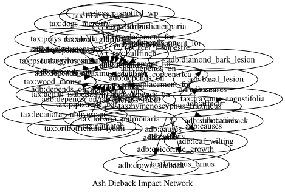

# Ash Dieback in the UK
Simon Frost

## Introduction

Ash dieback, caused by the fungus *Hymenoscyphus fraxineus*, is the most
serious tree disease to affect the UK in a generation. First confirmed
in the UK in 2012, it is expected to kill up to 80% of the country’s 80
million ash trees (*Fraxinus excelsior*), with cascading consequences
for the ~955 species that depend on ash.

This vignette builds a **knowledge graph for ash dieback** that
integrates pathology, ecology, and surveillance data, then analyses it
using the full breadth of RDFLib.jl: ontology design, tabular data
import, SHACL validation, SPARQL queries, property paths, Datalog
reasoning, ProbLog probabilistic inference, and visualization.

``` julia
using RDFLib
```

## 1. Disease Ontology

We define an ontology covering tree species, pathogens, associated
organisms, symptoms, woodland sites, and surveillance observations.

``` julia
g = RDFGraph()

# Namespaces
adb = Namespace("http://example.org/ashdieback#")
tax = Namespace("http://example.org/taxon/")
site = Namespace("http://example.org/site/")

bind!(g, "adb", adb)
bind!(g, "tax", tax)
bind!(g, "site", site)

# Classes
for cls in ["TreeSpecies", "Pathogen", "AssociatedSpecies",
            "Symptom", "WoodlandSite", "SurveyObservation",
            "DiseaseStage", "ConservationStatus"]
    add!(g, Triple(adb(cls), RDF.type, OWL.Class))
end

# Object properties
for (prop, dom, rng) in [
    ("causes",              "Pathogen",          "Symptom"),
    ("affects",             "Pathogen",          "TreeSpecies"),
    ("depends_on",          "AssociatedSpecies", "TreeSpecies"),
    ("has_symptom",         "SurveyObservation", "Symptom"),
    ("observed_at",         "SurveyObservation", "WoodlandSite"),
    ("has_disease_stage",   "SurveyObservation", "DiseaseStage"),
    ("secondary_pathogen",  "Pathogen",          "TreeSpecies"),
    ("replacement_for",     "TreeSpecies",       "TreeSpecies"),
    ("competes_with",       "Pathogen",          "Pathogen"),
    ("has_status",          "AssociatedSpecies", "ConservationStatus"),
]
    p = adb(prop)
    add!(g, Triple(p, RDF.type, OWL.ObjectProperty))
    add!(g, Triple(p, RDFS.domain, adb(dom)))
    add!(g, Triple(p, RDFS.range, adb(rng)))
end

# Datatype properties
for prop in ["common_name", "latin_name", "host_specificity",
             "infection_pct", "tree_count", "crown_loss_pct",
             "survey_date", "surveyor", "grid_ref", "region",
             "spore_load", "latitude", "longitude"]
    add!(g, Triple(adb(prop), RDF.type, OWL.DatatypeProperty))
end

println("Ontology: $(length(g)) triples")
```

    Ontology: 51 triples

## 2. The Pathogen and Its Hosts

``` julia
# The pathogen
hf = tax("hymenoscyphus_fraxineus")
add!(g, Triple(hf, RDF.type, adb("Pathogen")))
add!(g, Triple(hf, adb("common_name"), Literal("Ash dieback fungus")))
add!(g, Triple(hf, adb("latin_name"), Literal("Hymenoscyphus fraxineus")))

# Secondary pathogen that accelerates decline
armillaria = tax("armillaria_mellea")
add!(g, Triple(armillaria, RDF.type, adb("Pathogen")))
add!(g, Triple(armillaria, adb("common_name"), Literal("Honey fungus")))
add!(g, Triple(armillaria, adb("latin_name"), Literal("Armillaria mellea")))
add!(g, Triple(armillaria, adb("secondary_pathogen"), tax("fraxinus_excelsior")))

# Host tree species
trees = [
    ("fraxinus_excelsior",  "Common Ash",       "Fraxinus excelsior",  "primary"),
    ("fraxinus_angustifolia","Narrow-leaved Ash","Fraxinus angustifolia","primary"),
    ("fraxinus_ornus",      "Manna Ash",        "Fraxinus ornus",      "resistant"),
]
for (id, common, latin, susceptibility) in trees
    t = tax(id)
    add!(g, Triple(t, RDF.type, adb("TreeSpecies")))
    add!(g, Triple(t, adb("common_name"), Literal(common)))
    add!(g, Triple(t, adb("latin_name"), Literal(latin)))
    add!(g, Triple(t, adb("host_specificity"), Literal(susceptibility)))
    add!(g, Triple(hf, adb("affects"), t))
end

# Potential replacement species for ash
replacements = [
    ("quercus_robur",       "Pedunculate Oak",  "Quercus robur"),
    ("acer_campestre",      "Field Maple",      "Acer campestre"),
    ("tilia_cordata",       "Small-leaved Lime","Tilia cordata"),
    ("sorbus_aucuparia",    "Rowan",            "Sorbus aucuparia"),
    ("alnus_glutinosa",     "Common Alder",     "Alnus glutinosa"),
]
for (id, common, latin) in replacements
    t = tax(id)
    add!(g, Triple(t, RDF.type, adb("TreeSpecies")))
    add!(g, Triple(t, adb("common_name"), Literal(common)))
    add!(g, Triple(t, adb("latin_name"), Literal(latin)))
    add!(g, Triple(t, adb("replacement_for"), tax("fraxinus_excelsior")))
end

# Disease stages
for (stage, desc) in [
    ("healthy",    "No visible symptoms"),
    ("early",      "Leaf wilting, small lesions on shoots"),
    ("moderate",   "Crown dieback 20-50%, diamond-shaped bark lesions"),
    ("severe",     "Crown dieback >50%, extensive bark damage"),
    ("dead",       "Complete crown loss, tree dead or structurally unsafe"),
]
    s = adb(stage)
    add!(g, Triple(s, RDF.type, adb("DiseaseStage")))
    add!(g, Triple(s, RDFS.label, Literal(stage)))
    add!(g, Triple(s, RDFS.comment, Literal(desc)))
end

# Symptoms caused by the pathogen
symptoms = [
    "leaf_wilting", "shoot_dieback", "crown_dieback",
    "diamond_bark_lesion", "epicormic_growth", "basal_lesion",
]
for sym in symptoms
    s = adb(sym)
    add!(g, Triple(s, RDF.type, adb("Symptom")))
    add!(g, Triple(s, RDFS.label, Literal(replace(sym, '_' => ' '))))
    add!(g, Triple(hf, adb("causes"), s))
end

println("Disease model: $(length(g)) triples")
```

    Disease model: 126 triples

## 3. Species Dependent on Ash

Of ~955 species associated with ash in the UK, 45 are obligate
specialists and 62 are highly associated. We model representative
species across taxonomic groups.

``` julia
# Conservation status categories
for status in ["critical", "endangered", "vulnerable", "least_concern"]
    add!(g, Triple(adb(status), RDF.type, adb("ConservationStatus")))
    add!(g, Triple(adb(status), RDFS.label, Literal(replace(status, '_' => ' '))))
end

# Associated species: (id, common_name, group, specificity, status)
associated = [
    ("actias_isabellae",    "Centre-barred Sallow",    "moth",       "obligate",   "vulnerable"),
    ("prays_fraxinella",    "Ash Bud Moth",            "moth",       "obligate",   "least_concern"),
    ("agrilus_sinuatus",    "Jewel Beetle",            "beetle",     "obligate",   "endangered"),
    ("pseudargyrotoza",     "Triangle-marked Tortrix", "moth",       "obligate",   "vulnerable"),
    ("lobaria_pulmonaria",  "Tree Lungwort",           "lichen",     "high",       "vulnerable"),
    ("lecanora_sublivescens","Ash Lichen",             "lichen",     "obligate",   "critical"),
    ("orthotrichum_lyellii","Lyell's Bristle-moss",    "bryophyte",  "high",       "vulnerable"),
    ("lesser_spotted_wp",   "Lesser Spotted Woodpecker","bird",      "associated", "endangered"),
    ("bullfinch",           "Bullfinch",               "bird",       "associated", "least_concern"),
    ("nuthatch",            "Nuthatch",                "bird",       "associated", "least_concern"),
    ("wood_mouse",          "Wood Mouse",              "mammal",     "associated", "least_concern"),
    ("pipistrelle_bat",     "Common Pipistrelle",      "mammal",     "associated", "least_concern"),
    ("wild_garlic",         "Wild Garlic",             "plant",      "associated", "least_concern"),
    ("dogs_mercury",        "Dog's Mercury",           "plant",      "high",       "least_concern"),
    ("daldinia_concentrica","King Alfred's Cakes",     "fungus",     "obligate",   "least_concern"),
]

for (id, name, group, specificity, status) in associated
    s = tax(id)
    add!(g, Triple(s, RDF.type, adb("AssociatedSpecies")))
    add!(g, Triple(s, adb("common_name"), Literal(name)))
    add!(g, Triple(s, adb("host_specificity"), Literal(specificity)))
    add!(g, Triple(s, RDFS.comment, Literal(group)))
    add!(g, Triple(s, adb("depends_on"), tax("fraxinus_excelsior")))
    add!(g, Triple(s, adb("has_status"), adb(status)))
end

println("Associated species added: $(length(associated))")
println("Total graph: $(length(g)) triples")
```

    Associated species added: 15
    Total graph: 224 triples

## 4. Woodland Survey Sites

``` julia
sites = [
    ("thetford",     "Thetford Forest",     "East Anglia",       52.45, 0.82,  "TL8384"),
    ("ashdown",      "Ashdown Forest",      "South East",        51.07, 0.03,  "TQ4432"),
    ("wyre",         "Wyre Forest",         "West Midlands",     52.37, -2.35, "SO7476"),
    ("glenmore",     "Glenmore Forest",     "Scottish Highlands",57.16, -3.67, "NH9809"),
    ("coed_y_brenin","Coed y Brenin",       "North Wales",       52.82, -3.87, "SH7227"),
    ("killarney",    "Killarney Oakwoods",  "South West Ireland",51.98, -9.55, "V9685"),
    ("epping",       "Epping Forest",       "Greater London",    51.66, 0.05,  "TQ4198"),
    ("delamere",     "Delamere Forest",     "North West",        53.23, -2.68, "SJ5571"),
]

for (id, name, region, lat, lon, gridref) in sites
    s = site(id)
    add!(g, Triple(s, RDF.type, adb("WoodlandSite")))
    add!(g, Triple(s, adb("common_name"), Literal(name)))
    add!(g, Triple(s, adb("region"), Literal(region)))
    add!(g, Triple(s, adb("latitude"), Literal(lat)))
    add!(g, Triple(s, adb("longitude"), Literal(lon)))
    add!(g, Triple(s, adb("grid_ref"), Literal(gridref)))
end

println("$(length(sites)) woodland sites added")
```

    8 woodland sites added

## 5. Importing Surveillance Data from Tabular Sources

Forest Research runs annual ash dieback surveillance. We import survey
data using **tabular mapping**.

``` julia
surveys = [
    (id=1,  site_id="thetford",      stage="severe",   infection_pct=78, tree_count=150, crown_loss_pct=62, date="2023-06-15", surveyor="J.Smith"),
    (id=2,  site_id="ashdown",       stage="moderate",  infection_pct=55, tree_count=200, crown_loss_pct=38, date="2023-06-20", surveyor="A.Brown"),
    (id=3,  site_id="wyre",          stage="severe",    infection_pct=82, tree_count=180, crown_loss_pct=71, date="2023-07-01", surveyor="M.Jones"),
    (id=4,  site_id="glenmore",      stage="early",     infection_pct=15, tree_count=90,  crown_loss_pct=8,  date="2023-07-10", surveyor="S.MacLeod"),
    (id=5,  site_id="coed_y_brenin", stage="moderate",  infection_pct=45, tree_count=120, crown_loss_pct=32, date="2023-07-15", surveyor="D.Evans"),
    (id=6,  site_id="killarney",     stage="early",     infection_pct=22, tree_count=160, crown_loss_pct=12, date="2023-07-22", surveyor="P.Murphy"),
    (id=7,  site_id="epping",        stage="severe",    infection_pct=88, tree_count=95,  crown_loss_pct=75, date="2023-08-01", surveyor="L.Taylor"),
    (id=8,  site_id="delamere",      stage="moderate",  infection_pct=60, tree_count=110, crown_loss_pct=44, date="2023-08-10", surveyor="R.Wilson"),
    (id=9,  site_id="thetford",      stage="severe",    infection_pct=85, tree_count=150, crown_loss_pct=70, date="2024-06-12", surveyor="J.Smith"),
    (id=10, site_id="ashdown",       stage="severe",    infection_pct=68, tree_count=195, crown_loss_pct=52, date="2024-06-18", surveyor="A.Brown"),
    (id=11, site_id="glenmore",      stage="moderate",  infection_pct=32, tree_count=88,  crown_loss_pct=20, date="2024-07-08", surveyor="S.MacLeod"),
    (id=12, site_id="epping",        stage="dead",      infection_pct=95, tree_count=80,  crown_loss_pct=92, date="2024-08-05", surveyor="L.Taylor"),
]

# Build columns for mapping
surveys_rdf = [(;
    r...,
    site_uri = "http://example.org/site/" * r.site_id,
    stage_uri = "http://example.org/ashdieback#" * r.stage,
) for r in surveys]

m = RDFMapping(graph=g)

tpl = RDFTemplate(
    subject = :id,
    subject_prefix = "http://example.org/observation/survey_",
    properties = [
        (adb("observed_at"),       :site_uri,        IRIColumn()),
        (adb("has_disease_stage"), :stage_uri,       IRIColumn()),
        (adb("infection_pct"),     :infection_pct,   LiteralColumn(XSD.integer)),
        (adb("tree_count"),        :tree_count,      LiteralColumn(XSD.integer)),
        (adb("crown_loss_pct"),    :crown_loss_pct,  LiteralColumn(XSD.integer)),
        (adb("survey_date"),       :date,            LiteralColumn(XSD.date)),
        (adb("surveyor"),          :surveyor,        AutoColumn()),
    ],
    types = [adb("SurveyObservation")]
)

before = length(g)
rdf_map!(m, surveys_rdf, tpl)
println("Imported $(length(g) - before) triples from $(length(surveys)) survey records")
println("Total knowledge graph: $(length(g)) triples")
```

    Imported 96 triples from 12 survey records
    Total knowledge graph: 368 triples

## 6. Validating Survey Data with SHACL

We ensure every survey observation has required fields and valid ranges.

``` julia
shapes_ttl = """
    @prefix sh:  <http://www.w3.org/ns/shacl#> .
    @prefix adb: <http://example.org/ashdieback#> .
    @prefix xsd: <http://www.w3.org/2001/XMLSchema#> .

    adb:SurveyShape a sh:NodeShape ;
        sh:targetClass adb:SurveyObservation ;
        sh:property [
            sh:path adb:observed_at ;
            sh:minCount 1 ;
            sh:maxCount 1 ;
            sh:nodeKind sh:IRI ;
        ] ;
        sh:property [
            sh:path adb:has_disease_stage ;
            sh:minCount 1 ;
            sh:nodeKind sh:IRI ;
        ] ;
        sh:property [
            sh:path adb:infection_pct ;
            sh:minCount 1 ;
            sh:datatype xsd:integer ;
        ] ;
        sh:property [
            sh:path adb:survey_date ;
            sh:minCount 1 ;
        ] .
"""

report = rdf_validate(m, shapes_ttl)
println("Survey data validation: conforms = $(report.conforms)")
```

    Survey data validation: conforms = true

Test with an incomplete record:

``` julia
bad = URIRef("http://example.org/observation/survey_incomplete")
add!(g, Triple(bad, RDF.type, adb("SurveyObservation")))
add!(g, Triple(bad, adb("surveyor"), Literal("Unknown")))

report2 = rdf_validate(m, shapes_ttl)
println("After adding incomplete survey:")
println("  Conforms: $(report2.conforms)")
for r in report2.results
    println("  ✗ $(r.message)")
end

remove!(g, Triple(bad, RDF.type, adb("SurveyObservation")))
remove!(g, Triple(bad, adb("surveyor"), Literal("Unknown")))
```

    After adding incomplete survey:
      Conforms: false
      ✗ Expected at least 1 values for http://example.org/ashdieback#observed_at, got 0
      ✗ Expected at least 1 values for http://example.org/ashdieback#has_disease_stage, got 0
      ✗ Expected at least 1 values for http://example.org/ashdieback#survey_date, got 0
      ✗ Expected at least 1 values for http://example.org/ashdieback#infection_pct, got 0

    RDFGraph (368 triples)

## 7. Querying the Knowledge Graph

``` julia
# Helper for readable output
readable(x::Literal) = x.lexical
readable(x::URIRef) = split(x.value, r"[/#]")[end]
readable(x) = string(x)
```

    readable (generic function with 3 methods)

### Infection severity by site

``` julia
results = sparql_query(g, """
    PREFIX adb: <http://example.org/ashdieback#>
    PREFIX rdfs: <http://www.w3.org/2000/01/rdf-schema#>
    SELECT ?site_name ?region ?date ?infection ?crown_loss ?stage WHERE {
        ?obs a adb:SurveyObservation .
        ?obs adb:observed_at ?site .
        ?site adb:common_name ?site_name .
        ?site adb:region ?region .
        ?obs adb:infection_pct ?infection .
        ?obs adb:crown_loss_pct ?crown_loss .
        ?obs adb:survey_date ?date .
        ?obs adb:has_disease_stage ?stg .
        ?stg rdfs:label ?stage .
    }
    ORDER BY DESC(?infection)
""")
println("Survey results by infection severity:")
println("  $(rpad("Site", 20)) $(rpad("Region", 20)) $(rpad("Date", 12)) Inf%  Crown%  Stage")
println("  $("-"^85)")
for row in results
    println("  $(rpad(readable(row["site_name"]), 20)) " *
            "$(rpad(readable(row["region"]), 20)) " *
            "$(rpad(readable(row["date"]), 12)) " *
            "$(rpad(readable(row["infection"]), 6))" *
            "$(rpad(readable(row["crown_loss"]), 8))" *
            readable(row["stage"]))
end
```

    Survey results by infection severity:
      Site                 Region               Date         Inf%  Crown%  Stage
      -------------------------------------------------------------------------------------
      Epping Forest        Greater London       2024-08-05   95    92      dead
      Epping Forest        Greater London       2023-08-01   88    75      severe
      Thetford Forest      East Anglia          2024-06-12   85    70      severe
      Wyre Forest          West Midlands        2023-07-01   82    71      severe
      Thetford Forest      East Anglia          2023-06-15   78    62      severe
      Ashdown Forest       South East           2024-06-18   68    52      severe
      Delamere Forest      North West           2023-08-10   60    44      moderate
      Ashdown Forest       South East           2023-06-20   55    38      moderate
      Coed y Brenin        North Wales          2023-07-15   45    32      moderate
      Glenmore Forest      Scottish Highlands   2024-07-08   32    20      moderate
      Killarney Oakwoods   South West Ireland   2023-07-22   22    12      early
      Glenmore Forest      Scottish Highlands   2023-07-10   15    8       early

### Obligate species at risk

``` julia
results = sparql_query(g, """
    PREFIX adb: <http://example.org/ashdieback#>
    PREFIX rdfs: <http://www.w3.org/2000/01/rdf-schema#>
    SELECT ?name ?group ?status WHERE {
        ?sp a adb:AssociatedSpecies .
        ?sp adb:common_name ?name .
        ?sp adb:host_specificity "obligate" .
        ?sp rdfs:comment ?group .
        ?sp adb:has_status ?st .
        ?st rdfs:label ?status .
    }
    ORDER BY ?status ?name
""")
println("Obligate ash specialists ($(length(results)) species):")
for row in results
    println("  $(rpad(readable(row["name"]), 28)) $(rpad(readable(row["group"]), 12)) [$(readable(row["status"]))]")
end
```

    Obligate ash specialists (6 species):
      Ash Lichen                   lichen       [critical]
      Jewel Beetle                 beetle       [endangered]
      Ash Bud Moth                 moth         [least concern]
      King Alfred's Cakes          fungus       [least concern]
      Centre-barred Sallow         moth         [vulnerable]
      Triangle-marked Tortrix      moth         [vulnerable]

### Sites with \>70% infection

``` julia
results = sparql_query(g, """
    PREFIX adb: <http://example.org/ashdieback#>
    SELECT ?name ?infection ?date WHERE {
        ?obs a adb:SurveyObservation .
        ?obs adb:observed_at ?site .
        ?site adb:common_name ?name .
        ?obs adb:infection_pct ?infection .
        ?obs adb:survey_date ?date .
        FILTER (?infection > 70)
    }
    ORDER BY DESC(?infection)
""")
println("Critically affected sites (>70% infection):")
for row in results
    println("  $(rpad(readable(row["name"]), 20)) $(readable(row["infection"]))%  ($(readable(row["date"])))")
end
```

    Critically affected sites (>70% infection):
      Epping Forest        95%  (2024-08-05)
      Epping Forest        88%  (2023-08-01)
      Thetford Forest      85%  (2024-06-12)
      Wyre Forest          82%  (2023-07-01)
      Thetford Forest      78%  (2023-06-15)

## 8. Tracing Impact Pathways with Property Paths

Which species are transitively threatened by the pathogen?

``` julia
results = sparql_query(g, """
    PREFIX adb: <http://example.org/ashdieback#>
    PREFIX tax: <http://example.org/taxon/>
    SELECT ?name ?specificity WHERE {
        tax:hymenoscyphus_fraxineus adb:affects/^adb:depends_on ?sp .
        ?sp adb:common_name ?name .
        ?sp adb:host_specificity ?specificity .
    }
    ORDER BY ?specificity ?name
""")
println("Species threatened via ash dependency ($(length(results))):")
for row in results
    println("  $(rpad(readable(row["name"]), 30)) [$(readable(row["specificity"]))]")
end
```

    Species threatened via ash dependency (15):
      Bullfinch                      [associated]
      Common Pipistrelle             [associated]
      Lesser Spotted Woodpecker      [associated]
      Nuthatch                       [associated]
      Wild Garlic                    [associated]
      Wood Mouse                     [associated]
      Dog's Mercury                  [high]
      Lyell's Bristle-moss           [high]
      Tree Lungwort                  [high]
      Ash Bud Moth                   [obligate]
      Ash Lichen                     [obligate]
      Centre-barred Sallow           [obligate]
      Jewel Beetle                   [obligate]
      King Alfred's Cakes            [obligate]
      Triangle-marked Tortrix        [obligate]

### Replacement tree options

``` julia
results = sparql_query(g, """
    PREFIX adb: <http://example.org/ashdieback#>
    PREFIX tax: <http://example.org/taxon/>
    SELECT ?name ?latin WHERE {
        ?tree adb:replacement_for tax:fraxinus_excelsior .
        ?tree adb:common_name ?name .
        ?tree adb:latin_name ?latin .
    }
    ORDER BY ?name
""")
println("Potential replacement species for ash:")
for row in results
    println("  $(readable(row["name"])) ($(readable(row["latin"])))")
end
```

    Potential replacement species for ash:
      Common Alder (Alnus glutinosa)
      Field Maple (Acer campestre)
      Pedunculate Oak (Quercus robur)
      Rowan (Sorbus aucuparia)
      Small-leaved Lime (Tilia cordata)

## 9. Inferring Risk with Datalog Reasoning

We use Datalog to derive which species face extinction risk based on
host specificity and conservation status, and which sites are critical.

``` julia
n3_rules = """
    @prefix adb: <http://example.org/ashdieback#> .
    @prefix tax: <http://example.org/taxon/> .
    @prefix site: <http://example.org/site/> .

    # Facts: species dependencies and specificity
    tax:actias_isabellae    adb:host_specificity "obligate" .
    tax:prays_fraxinella    adb:host_specificity "obligate" .
    tax:agrilus_sinuatus    adb:host_specificity "obligate" .
    tax:pseudargyrotoza     adb:host_specificity "obligate" .
    tax:lobaria_pulmonaria  adb:host_specificity "high" .
    tax:lecanora_sublivescens adb:host_specificity "obligate" .
    tax:orthotrichum_lyellii adb:host_specificity "high" .
    tax:daldinia_concentrica adb:host_specificity "obligate" .

    tax:actias_isabellae    adb:has_status adb:vulnerable .
    tax:agrilus_sinuatus    adb:has_status adb:endangered .
    tax:pseudargyrotoza     adb:has_status adb:vulnerable .
    tax:lobaria_pulmonaria  adb:has_status adb:vulnerable .
    tax:lecanora_sublivescens adb:has_status adb:critical .
    tax:orthotrichum_lyellii adb:has_status adb:vulnerable .

    # Facts: survey infection levels
    site:thetford   adb:infection_pct "85" .
    site:epping     adb:infection_pct "95" .
    site:wyre       adb:infection_pct "82" .
    site:ashdown    adb:infection_pct "68" .
    site:delamere   adb:infection_pct "60" .
    site:coed_y_brenin adb:infection_pct "45" .
    site:glenmore   adb:infection_pct "32" .
    site:killarney  adb:infection_pct "22" .

    # Rule: obligate species face extinction risk from ash dieback
    { ?sp adb:host_specificity "obligate" } => { ?sp adb:faces_risk adb:ash_dieback_extinction } .

    # Rule: already-threatened obligate species are critically at risk
    { ?sp adb:host_specificity "obligate" . ?sp adb:has_status adb:vulnerable }
        => { ?sp adb:faces_risk adb:critical_extinction } .
    { ?sp adb:host_specificity "obligate" . ?sp adb:has_status adb:endangered }
        => { ?sp adb:faces_risk adb:critical_extinction } .
    { ?sp adb:host_specificity "obligate" . ?sp adb:has_status adb:critical }
        => { ?sp adb:faces_risk adb:critical_extinction } .

    # Rule: highly associated species are at moderate risk
    { ?sp adb:host_specificity "high" } => { ?sp adb:faces_risk adb:population_decline } .
"""

g_dl = parse_rdf(n3_rules, N3Format())
println("Before reasoning: $(length(g_dl)) triples")

g_inferred = datalog_reason(g_dl)
println("After reasoning:  $(length(g_inferred)) triples")

# Species at critical extinction risk
critical = [t.subject for t in triples(g_inferred,
    (nothing, adb("faces_risk"), adb("critical_extinction")))]
println("\nSpecies at critical extinction risk ($(length(critical))):")
for sp in sort(critical; by=x -> split(string(x), '/')[end])
    println("  ⚠ $(split(string(sp), '/')[end])")
end

# Species at general extinction risk
general = [t.subject for t in triples(g_inferred,
    (nothing, adb("faces_risk"), adb("ash_dieback_extinction")))]
println("\nAll obligate species facing extinction risk ($(length(general))):")
for sp in sort(general; by=x -> split(string(x), '/')[end])
    println("  • $(split(string(sp), '/')[end])")
end
```

    Before reasoning: 27 triples
    After reasoning:  38 triples

    Species at critical extinction risk (8):
      ⚠ actias_isabellae
      ⚠ agrilus_sinuatus
      ⚠ daldinia_concentrica
      ⚠ lecanora_sublivescens
      ⚠ lobaria_pulmonaria
      ⚠ orthotrichum_lyellii
      ⚠ prays_fraxinella
      ⚠ pseudargyrotoza

    All obligate species facing extinction risk (6):
      • actias_isabellae
      • agrilus_sinuatus
      • daldinia_concentrica
      • lecanora_sublivescens
      • prays_fraxinella
      • pseudargyrotoza

## 10. Probabilistic Outcomes with ProbLog

We model the probability of different outcomes for an ash woodland given
ash dieback, considering factors like genetic resistance, management
intervention, and secondary infection.

``` julia
woodland_model = """
    0.05::genetic_resistance.
    0.90::pathogen_present.
    0.30::management_intervention.
    0.40::secondary_infection.
    0.60::wet_summer.

    spore_dispersal :- pathogen_present, wet_summer.
    infection :- spore_dispersal, \\+genetic_resistance.
    rapid_decline :- infection, secondary_infection.
    slow_decline :- infection, \\+secondary_infection, \\+management_intervention.
    managed_decline :- infection, management_intervention, \\+secondary_infection.
    tree_survival :- genetic_resistance.
    tree_survival :- management_intervention, \\+rapid_decline.

    query(infection).
    query(rapid_decline).
    query(slow_decline).
    query(managed_decline).
    query(tree_survival).
"""

results = problog_query(woodland_model)
println("Ash woodland outcome probabilities (baseline):")
for key in ["infection", "rapid_decline", "slow_decline", "managed_decline", "tree_survival"]
    haskey(results, key) && println("  $(rpad(key, 20)) $(round(results[key]; digits=4))")
end
```

    Ash woodland outcome probabilities (baseline):
      infection            0.513
      rapid_decline        0.2052
      slow_decline         0.2155
      managed_decline      0.0923
      tree_survival        0.2734

### Scenario: Active management (intervention guaranteed)

``` julia
managed = woodland_model * "\n    evidence(management_intervention, true).\n"

r_managed = problog_query(managed)
println("With active management:")
for key in ["infection", "rapid_decline", "slow_decline", "managed_decline", "tree_survival"]
    haskey(r_managed, key) && println("  $(rpad(key, 20)) $(round(r_managed[key]; digits=4))")
end
```

    With active management:
      infection            0.513
      rapid_decline        0.2052
      slow_decline         0.0
      managed_decline      0.3078
      tree_survival        0.7948

### Scenario: No management, wet summer

``` julia
worst = woodland_model * """
    evidence(management_intervention, false).
    evidence(wet_summer, true).
"""

r_worst = problog_query(worst)
println("Worst case (no management, wet summer):")
for key in ["infection", "rapid_decline", "slow_decline", "managed_decline", "tree_survival"]
    haskey(r_worst, key) && println("  $(rpad(key, 20)) $(round(r_worst[key]; digits=4))")
end
```

    Worst case (no management, wet summer):
      infection            0.855
      rapid_decline        0.342
      slow_decline         0.513
      managed_decline      0.0
      tree_survival        0.05

### Comparing management scenarios

``` julia
println("Impact of management on ash woodland outcomes:\n")
println("  $(rpad("Outcome", 22)) $(rpad("Baseline", 12)) $(rpad("Managed", 12)) $(rpad("Worst case", 12)) Managed vs Worst")
println("  $("-"^72)")
for key in ["infection", "rapid_decline", "slow_decline", "managed_decline", "tree_survival"]
    p_base = get(results, key, 0.0)
    p_man  = get(r_managed, key, 0.0)
    p_bad  = get(r_worst, key, 0.0)
    delta  = p_man - p_bad
    sign   = delta >= 0 ? "+" : ""
    println("  $(rpad(key, 22)) $(rpad(round(p_base; digits=4), 12)) " *
            "$(rpad(round(p_man; digits=4), 12)) $(rpad(round(p_bad; digits=4), 12)) " *
            "$(sign)$(round(delta; digits=4))")
end
```

    Impact of management on ash woodland outcomes:

      Outcome                Baseline     Managed      Worst case   Managed vs Worst
      ------------------------------------------------------------------------
      infection              0.513        0.513        0.855        -0.342
      rapid_decline          0.2052       0.2052       0.342        -0.1368
      slow_decline           0.2155       0.0          0.513        -0.513
      managed_decline        0.0923       0.3078       0.0          +0.3078
      tree_survival          0.2734       0.7948       0.05         +0.7448

## 11. Visualization

### Disease impact network

``` julia
# Build a focused graph showing pathogen → host → dependent species
viz_g = RDFGraph()
bind!(viz_g, "adb", adb)
bind!(viz_g, "tax", tax)

for t in triples(g, (nothing, adb("affects"), nothing))
    add!(viz_g, t)
end
for t in triples(g, (nothing, adb("depends_on"), nothing))
    add!(viz_g, t)
end
for t in triples(g, (nothing, adb("causes"), nothing))
    add!(viz_g, t)
end
for t in triples(g, (nothing, adb("replacement_for"), nothing))
    add!(viz_g, t)
end

dot_str = to_dot(viz_g; label="Ash Dieback Impact Network")
println("Impact network: $(length(viz_g)) triples")
```

    Impact network: 29 triples

``` julia
using GraphViz
GraphViz.load(IOBuffer(dot_str))
```



### Graph statistics

``` julia
stats = graph_stats(g)
println("Ash dieback knowledge graph summary:")
println("  Total triples:    $(stats.triples)")
println("  Unique subjects:  $(stats.subjects)")
println("  Unique predicates: $(stats.predicates)")
println("  Unique objects:   $(stats.objects)")
println("  URI references:   $(stats.uri_refs)")
println("  Literals:         $(stats.literals)")
```

    Ash dieback knowledge graph summary:
      Total triples:    368
      Unique subjects:  91
      Unique predicates: 25
      Unique objects:   196
      URI references:   99
      Literals:         160

### Serialization

``` julia
ttl = serialize(g, TurtleFormat())
lines = split(ttl, '\n')
println("Serialized to Turtle: $(length(lines)) lines, $(length(ttl)) bytes")
println("\nFirst 20 lines:")
for line in Iterators.take(lines, 20)
    println("  $line")
end
```

    Serialized to Turtle: 469 lines, 13819 bytes

    First 20 lines:
      @prefix adb: <http://example.org/ashdieback#> .
      @prefix ns1: <http://example.org/observation/> .
      @prefix owl: <http://www.w3.org/2002/07/owl#> .
      @prefix rdf: <http://www.w3.org/1999/02/22-rdf-syntax-ns#> .
      @prefix rdfs: <http://www.w3.org/2000/01/rdf-schema#> .
      @prefix site: <http://example.org/site/> .
      @prefix skos: <http://www.w3.org/2004/02/skos/core#> .
      @prefix tax: <http://example.org/taxon/> .
      @prefix xsd: <http://www.w3.org/2001/XMLSchema#> .
      
      adb:AssociatedSpecies a owl:Class .
      
      adb:ConservationStatus a owl:Class .
      
      adb:DiseaseStage a owl:Class .
      
      adb:Pathogen a owl:Class .
      
      adb:SurveyObservation a owl:Class .
      

## Summary

This vignette modeled the UK ash dieback crisis as a knowledge graph:

| Feature | Application |
|----|----|
| **OWL Ontology** | Pathogens, host trees, symptoms, disease stages, dependent species |
| **Tabular Mapping** | Forest Research surveillance data from spreadsheets |
| **SHACL Validation** | Ensuring survey records have required fields |
| **SPARQL Queries** | Infection severity, obligate species, critical sites |
| **Property Paths** | Tracing pathogen → host → dependent species impact chains |
| **Datalog Reasoning** | Inferring extinction risk from host specificity + conservation status |
| **ProbLog** | Probabilistic woodland outcomes: management reduces rapid decline |
| **Visualization** | Disease impact network via GraphViz |

Key findings from the probabilistic model: active management
significantly increases tree survival probability and shifts outcomes
from rapid decline toward managed decline, highlighting the importance
of intervention even when the pathogen is widespread.
