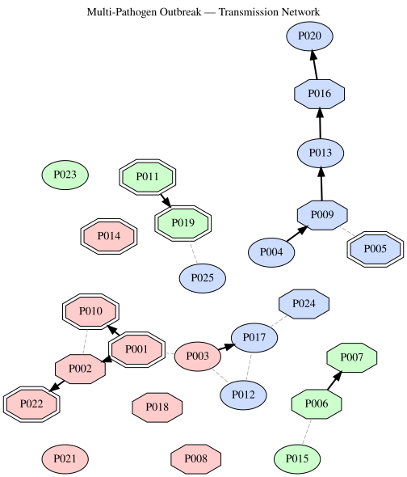

# Epidemiology Knowledge Graph
Simon Frost

## Introduction

Epidemiology requires integrating heterogeneous data — pathogens, hosts,
clinical observations, geographic surveillance, intervention records,
and genomic lineage data — into a coherent knowledge model. **Semantic
web technologies** are well-suited for this: RDF naturally represents
linked entities across domains, SPARQL enables complex cross-cutting
queries, and logical reasoning can infer transmission chains and risk
factors.

This vignette builds a **comprehensive infectious disease knowledge
graph** covering a fictitious multi-pathogen respiratory outbreak
scenario, and demonstrates RDFLib.jl’s full capabilities:

1.  **OWL ontology** — pathogens, hosts, clinical features,
    interventions
2.  **Tabular mapping** — surveillance case records into RDF
3.  **SHACL validation** — data quality assurance
4.  **SPARQL queries** — epidemiological analytics
5.  **Property paths** — contact tracing chains
6.  **Datalog reasoning** — transmission inference and risk
    classification
7.  **N3 reasoning** — risk stratification with math builtins, serial
    interval computation, backward-chaining clinical decision support
8.  **ProbLog** — probabilistic outbreak modeling
9.  **Visualization** — outbreak network and transmission diagrams

The scenario models an outbreak involving three pathogens (an influenza
variant, a novel coronavirus, and an RSV strain) circulating
simultaneously across hospital wards and community settings, reflecting
the challenges of real-world syndromic surveillance.

``` julia
using RDFLib

# Helper to extract readable strings from SPARQL result values
readable(x::Literal) = x.lexical
readable(x::URIRef) = split(x.value, r"[/#]")[end]
readable(x) = string(x)
```

    readable (generic function with 3 methods)

## 1. Epidemiology Ontology

We define an OWL ontology modelling pathogens, patients, clinical
presentations, diagnostic tests, locations, interventions, and contact
events.

``` julia
g = RDFGraph()

epi  = Namespace("http://example.org/epi#")
pat  = Namespace("http://example.org/patient/")
path = Namespace("http://example.org/pathogen/")
loc  = Namespace("http://example.org/location/")
tst  = Namespace("http://example.org/test/")
int  = Namespace("http://example.org/intervention/")

bind!(g, "epi",  epi)
bind!(g, "pat",  pat)
bind!(g, "path", path)
bind!(g, "loc",  loc)
bind!(g, "tst",  tst)
bind!(g, "int",  int)

# OWL classes
for cls in ["Pathogen", "Patient", "ClinicalPresentation",
            "DiagnosticTest", "Location", "Intervention",
            "ContactEvent", "Outbreak", "CaseReport",
            "Symptom", "RiskFactor",
            # Pathogen subtypes
            "Virus", "Bacteria",
            # Location subtypes
            "Hospital", "CommunityFacility", "School",
            # Intervention subtypes
            "Vaccination", "Quarantine", "Treatment", "ContactTracing"]
    add!(g, Triple(epi(cls), RDF.type, OWL.Class))
end

# Subclass hierarchy
for (sub, sup) in [
    ("Virus", "Pathogen"), ("Bacteria", "Pathogen"),
    ("Hospital", "Location"), ("CommunityFacility", "Location"), ("School", "Location"),
    ("Vaccination", "Intervention"), ("Quarantine", "Intervention"),
    ("Treatment", "Intervention"), ("ContactTracing", "Intervention"),
]
    add!(g, Triple(epi(sub), RDFS.subClassOf, epi(sup)))
end

# Object properties
for (prop, dom, rng) in [
    ("infectedBy",       "Patient",        "Pathogen"),
    ("confirmedBy",      "CaseReport",     "DiagnosticTest"),
    ("hasSymptom",       "CaseReport",     "Symptom"),
    ("hasRiskFactor",    "Patient",        "RiskFactor"),
    ("locatedAt",        "CaseReport",     "Location"),
    ("receivedIntervention", "Patient",    "Intervention"),
    ("contactWith",      "Patient",        "Patient"),
    ("partOfOutbreak",   "CaseReport",     "Outbreak"),
    ("transmittedFrom",  "Patient",        "Patient"),
    ("caseForPatient",   "CaseReport",     "Patient"),
    ("onsetDate",        "CaseReport",     nothing),
    ("testDate",         "DiagnosticTest", nothing),
    ("testResult",       "DiagnosticTest", nothing),
    ("severity",         "CaseReport",     nothing),
    ("ageGroup",         "Patient",        nothing),
    ("vaccinationStatus","Patient",        nothing),
]
    uri = epi(prop)
    add!(g, Triple(uri, RDF.type, OWL.ObjectProperty))
    add!(g, Triple(uri, RDFS.domain, epi(dom)))
    if rng !== nothing
        add!(g, Triple(uri, RDFS.range, epi(rng)))
    end
end

println("Epidemiology ontology: $(length(g)) triples")
```

    Epidemiology ontology: 71 triples

## 2. Populating the Knowledge Graph

### 2a. Pathogens

``` julia
pathogens = [
    ("influenza_A_H3N2", "Influenza A (H3N2)",    "Virus",    "Orthomyxoviridae", 1.3),
    ("SARS_CoV_2_JN1",   "SARS-CoV-2 JN.1",      "Virus",    "Coronaviridae",    2.5),
    ("RSV_B",            "RSV subtype B",          "Virus",    "Pneumoviridae",    3.0),
]

for (id, name, cls, family, r0) in pathogens
    p = path(id)
    add!(g, Triple(p, RDF.type, epi("Pathogen")))
    add!(g, Triple(p, RDF.type, epi(cls)))
    add!(g, Triple(p, RDFS.label, Literal(name)))
    add!(g, Triple(p, epi("family"), Literal(family)))
    add!(g, Triple(p, epi("basicReproductionNumber"), Literal(r0)))
end

println("Added $(length(pathogens)) pathogens")
```

    Added 3 pathogens

### 2b. Locations

``` julia
locations = [
    ("royal_infirmary",  "Royal Infirmary",       "Hospital"),
    ("general_hospital", "General Hospital",       "Hospital"),
    ("care_home_A",      "Sunrise Care Home",      "CommunityFacility"),
    ("care_home_B",      "Meadowbrook Care Home",  "CommunityFacility"),
    ("primary_school",   "Oakfield Primary School", "School"),
    ("secondary_school", "Riverside Academy",       "School"),
]

for (id, name, cls) in locations
    l = loc(id)
    add!(g, Triple(l, RDF.type, epi("Location")))
    add!(g, Triple(l, RDF.type, epi(cls)))
    add!(g, Triple(l, RDFS.label, Literal(name)))
end

println("Added $(length(locations)) locations")
```

    Added 6 locations

### 2c. Symptoms and risk factors

``` julia
symptoms = ["fever", "cough", "dyspnoea", "fatigue", "myalgia",
            "sore_throat", "rhinorrhoea", "headache", "wheeze",
            "hypoxia", "tachypnoea"]

for s in symptoms
    add!(g, Triple(epi(s), RDF.type, epi("Symptom")))
    add!(g, Triple(epi(s), RDFS.label, Literal(replace(s, "_" => " "))))
end

risk_factors = ["age_over_65", "immunocompromised", "chronic_lung_disease",
                "diabetes", "cardiovascular_disease", "obesity",
                "pregnancy", "healthcare_worker"]

for rf in risk_factors
    add!(g, Triple(epi(rf), RDF.type, epi("RiskFactor")))
    add!(g, Triple(epi(rf), RDFS.label, Literal(replace(rf, "_" => " "))))
end

println("Added $(length(symptoms)) symptoms, $(length(risk_factors)) risk factors")
```

    Added 11 symptoms, 8 risk factors

### 2d. Patients (25 patients in the outbreak)

``` julia
patients = [
    # (id, name, age_group, risk_factors, vaccination_status)
    ("P001", "Patient 001", "65+",   ["age_over_65", "chronic_lung_disease"], "vaccinated"),
    ("P002", "Patient 002", "65+",   ["age_over_65", "diabetes"],             "vaccinated"),
    ("P003", "Patient 003", "40-64", ["healthcare_worker"],                   "vaccinated"),
    ("P004", "Patient 004", "18-39", String[],                                "unvaccinated"),
    ("P005", "Patient 005", "65+",   ["age_over_65", "cardiovascular_disease"],"vaccinated"),
    ("P006", "Patient 006", "5-17",  String[],                                "vaccinated"),
    ("P007", "Patient 007", "5-17",  String[],                                "unvaccinated"),
    ("P008", "Patient 008", "18-39", ["pregnancy"],                           "vaccinated"),
    ("P009", "Patient 009", "40-64", ["obesity"],                             "unvaccinated"),
    ("P010", "Patient 010", "65+",   ["age_over_65", "immunocompromised"],    "vaccinated"),
    ("P011", "Patient 011", "0-4",   String[],                                "unvaccinated"),
    ("P012", "Patient 012", "40-64", ["healthcare_worker"],                   "vaccinated"),
    ("P013", "Patient 013", "18-39", String[],                                "vaccinated"),
    ("P014", "Patient 014", "65+",   ["age_over_65", "chronic_lung_disease"], "unvaccinated"),
    ("P015", "Patient 015", "5-17",  String[],                                "vaccinated"),
    ("P016", "Patient 016", "40-64", ["diabetes", "obesity"],                 "unvaccinated"),
    ("P017", "Patient 017", "18-39", ["healthcare_worker"],                   "vaccinated"),
    ("P018", "Patient 018", "65+",   ["age_over_65"],                         "vaccinated"),
    ("P019", "Patient 019", "0-4",   String[],                                "unvaccinated"),
    ("P020", "Patient 020", "40-64", String[],                                "vaccinated"),
    ("P021", "Patient 021", "18-39", String[],                                "unvaccinated"),
    ("P022", "Patient 022", "65+",   ["age_over_65", "immunocompromised"],    "vaccinated"),
    ("P023", "Patient 023", "5-17",  String[],                                "vaccinated"),
    ("P024", "Patient 024", "40-64", ["chronic_lung_disease"],                "vaccinated"),
    ("P025", "Patient 025", "18-39", ["healthcare_worker"],                   "vaccinated"),
]

for (id, name, age_group, risks, vax) in patients
    p = pat(id)
    add!(g, Triple(p, RDF.type, epi("Patient")))
    add!(g, Triple(p, RDFS.label, Literal(name)))
    add!(g, Triple(p, epi("ageGroup"), Literal(age_group)))
    add!(g, Triple(p, epi("vaccinationStatus"), Literal(vax)))
    for rf in risks
        add!(g, Triple(p, epi("hasRiskFactor"), epi(rf)))
    end
end

println("Added $(length(patients)) patients")
```

    Added 25 patients

### 2e. Surveillance data via tabular mapping

We import 30 case reports from a surveillance line list into the
knowledge graph using **tabular mapping**.

``` julia
case_records = [
    # (case_id, patient, pathogen, location, onset, severity, symptoms...)
    (id=1,  patient="P001", pathogen="influenza_A_H3N2", location="care_home_A",     onset="2025-01-15", severity="severe",   symp="fever,cough,dyspnoea,myalgia"),
    (id=2,  patient="P002", pathogen="influenza_A_H3N2", location="care_home_A",     onset="2025-01-16", severity="moderate", symp="fever,cough,fatigue"),
    (id=3,  patient="P003", pathogen="influenza_A_H3N2", location="royal_infirmary", onset="2025-01-17", severity="mild",     symp="fever,cough,sore_throat"),
    (id=4,  patient="P010", pathogen="influenza_A_H3N2", location="care_home_A",     onset="2025-01-18", severity="severe",   symp="fever,cough,dyspnoea,hypoxia"),
    (id=5,  patient="P018", pathogen="influenza_A_H3N2", location="care_home_B",     onset="2025-01-19", severity="moderate", symp="fever,cough,myalgia,fatigue"),
    (id=6,  patient="P004", pathogen="SARS_CoV_2_JN1",  location="general_hospital", onset="2025-01-20", severity="mild",    symp="cough,sore_throat,headache"),
    (id=7,  patient="P005", pathogen="SARS_CoV_2_JN1",  location="general_hospital", onset="2025-01-21", severity="severe",  symp="fever,cough,dyspnoea,hypoxia,fatigue"),
    (id=8,  patient="P009", pathogen="SARS_CoV_2_JN1",  location="general_hospital", onset="2025-01-22", severity="moderate",symp="fever,cough,myalgia"),
    (id=9,  patient="P012", pathogen="SARS_CoV_2_JN1",  location="royal_infirmary", onset="2025-01-22", severity="mild",     symp="cough,rhinorrhoea"),
    (id=10, patient="P013", pathogen="SARS_CoV_2_JN1",  location="general_hospital", onset="2025-01-23", severity="mild",    symp="cough,sore_throat"),
    (id=11, patient="P006", pathogen="RSV_B",            location="primary_school",   onset="2025-01-14", severity="moderate",symp="cough,wheeze,rhinorrhoea"),
    (id=12, patient="P007", pathogen="RSV_B",            location="primary_school",   onset="2025-01-15", severity="moderate",symp="cough,wheeze,fever"),
    (id=13, patient="P011", pathogen="RSV_B",            location="royal_infirmary",  onset="2025-01-17", severity="severe",  symp="cough,wheeze,dyspnoea,tachypnoea,hypoxia"),
    (id=14, patient="P015", pathogen="RSV_B",            location="secondary_school", onset="2025-01-18", severity="mild",    symp="cough,rhinorrhoea"),
    (id=15, patient="P019", pathogen="RSV_B",            location="royal_infirmary",  onset="2025-01-19", severity="severe",  symp="wheeze,dyspnoea,tachypnoea,hypoxia"),
    (id=16, patient="P008", pathogen="influenza_A_H3N2", location="general_hospital", onset="2025-01-20", severity="moderate",symp="fever,cough,myalgia"),
    (id=17, patient="P014", pathogen="influenza_A_H3N2", location="care_home_B",     onset="2025-01-21", severity="severe",   symp="fever,cough,dyspnoea,hypoxia"),
    (id=18, patient="P016", pathogen="SARS_CoV_2_JN1",  location="general_hospital", onset="2025-01-24", severity="moderate",symp="fever,cough,fatigue,myalgia"),
    (id=19, patient="P017", pathogen="SARS_CoV_2_JN1",  location="royal_infirmary", onset="2025-01-24", severity="mild",     symp="cough,sore_throat"),
    (id=20, patient="P020", pathogen="SARS_CoV_2_JN1",  location="general_hospital", onset="2025-01-25", severity="mild",    symp="cough,rhinorrhoea,headache"),
    (id=21, patient="P021", pathogen="influenza_A_H3N2", location="secondary_school", onset="2025-01-22", severity="mild",   symp="fever,cough,sore_throat"),
    (id=22, patient="P022", pathogen="influenza_A_H3N2", location="care_home_A",     onset="2025-01-23", severity="severe",   symp="fever,cough,dyspnoea,hypoxia,fatigue"),
    (id=23, patient="P023", pathogen="RSV_B",            location="primary_school",   onset="2025-01-20", severity="mild",    symp="cough,rhinorrhoea"),
    (id=24, patient="P024", pathogen="SARS_CoV_2_JN1",  location="royal_infirmary", onset="2025-01-25", severity="moderate", symp="fever,cough,dyspnoea"),
    (id=25, patient="P025", pathogen="SARS_CoV_2_JN1",  location="royal_infirmary", onset="2025-01-26", severity="mild",     symp="cough,fatigue"),
]

# Add URI columns for linking
cases_with_uris = [(; r...,
    patient_uri = "http://example.org/patient/" * r.patient,
    pathogen_uri = "http://example.org/pathogen/" * r.pathogen,
    location_uri = "http://example.org/location/" * r.location,
) for r in case_records]

m = RDFMapping(graph=g)

tpl = RDFTemplate(
    subject = :id,
    subject_prefix = "http://example.org/case/",
    properties = [
        (epi("caseForPatient"), :patient_uri,  IRIColumn()),
        (epi("infectedBy"),     :pathogen_uri, IRIColumn()),
        (epi("locatedAt"),      :location_uri, IRIColumn()),
        (epi("onsetDate"),      :onset,        LiteralColumn(XSD.date)),
        (epi("severity"),       :severity,     AutoColumn()),
    ],
    types = [epi("CaseReport")]
)

before = length(g)
rdf_map!(m, cases_with_uris, tpl)
println("Imported $(length(g) - before) case triples from $(length(case_records)) records")

# Also add symptoms for each case
for r in case_records
    case_uri = URIRef("http://example.org/case/$(r.id)")
    for s in split(r.symp, ",")
        add!(g, Triple(case_uri, epi("hasSymptom"), epi(strip(s))))
    end
end

println("Total knowledge graph: $(length(g)) triples")
```

    Imported 150 case triples from 25 records
    Total knowledge graph: 495 triples

### 2f. Contact and transmission events

Known contact tracing data links patients through exposure events.

``` julia
# Known contacts (bidirectional exposure)
contacts = [
    ("P001", "P002"),  # care home A residents
    ("P001", "P010"),
    ("P002", "P010"),
    ("P002", "P022"),
    ("P003", "P012"),  # healthcare workers at Royal Infirmary
    ("P003", "P017"),
    ("P012", "P017"),
    ("P006", "P007"),  # primary school pupils
    ("P006", "P015"),
    ("P004", "P009"),  # general hospital contacts
    ("P005", "P009"),
    ("P009", "P013"),
    ("P013", "P016"),
    ("P016", "P020"),
    ("P011", "P019"),  # RSV paediatric ward
    ("P003", "P001"),  # HCW → care home visit
    ("P017", "P024"),  # HCW → hospital
    ("P025", "P019"),  # hospital contact
]

for (a, b) in contacts
    add!(g, Triple(pat(a), epi("contactWith"), pat(b)))
    add!(g, Triple(pat(b), epi("contactWith"), pat(a)))
end

# Known transmission events (directed: infector → infectee)
transmissions = [
    ("P001", "P002"),  # index case → roommate
    ("P001", "P010"),  # index → vulnerable resident
    ("P002", "P022"),  # resident → resident
    ("P006", "P007"),  # school RSV
    ("P004", "P009"),  # hospital COVID
    ("P009", "P013"),  # hospital chain
    ("P013", "P016"),
    ("P016", "P020"),
    ("P011", "P019"),  # paediatric RSV
    ("P003", "P017"),  # HCW flu
]

for (src, tgt) in transmissions
    add!(g, Triple(pat(tgt), epi("transmittedFrom"), pat(src)))
end

println("Added $(length(contacts)) contact links, $(length(transmissions)) known transmissions")
println("Total: $(length(g)) triples")
```

    Added 18 contact links, 10 known transmissions
    Total: 541 triples

## 3. Defining the Outbreak

``` julia
# Three concurrent outbreaks
add!(g, Triple(epi("flu_outbreak"),   RDF.type, epi("Outbreak")))
add!(g, Triple(epi("flu_outbreak"),   RDFS.label, Literal("Influenza A H3N2 winter outbreak")))
add!(g, Triple(epi("covid_outbreak"), RDF.type, epi("Outbreak")))
add!(g, Triple(epi("covid_outbreak"), RDFS.label, Literal("SARS-CoV-2 JN.1 nosocomial cluster")))
add!(g, Triple(epi("rsv_outbreak"),   RDF.type, epi("Outbreak")))
add!(g, Triple(epi("rsv_outbreak"),   RDFS.label, Literal("RSV-B paediatric wave")))

# Link cases to outbreaks based on pathogen
for r in case_records
    case_uri = URIRef("http://example.org/case/$(r.id)")
    outbreak = if r.pathogen == "influenza_A_H3N2"
        epi("flu_outbreak")
    elseif r.pathogen == "SARS_CoV_2_JN1"
        epi("covid_outbreak")
    else
        epi("rsv_outbreak")
    end
    add!(g, Triple(case_uri, epi("partOfOutbreak"), outbreak))
end

println("Three outbreaks defined, $(length(g)) total triples")
```

    Three outbreaks defined, 572 total triples

## 4. SHACL Validation

We validate that every case report has required fields: a linked
patient, pathogen, location, onset date, and severity classification.

``` julia
shapes_ttl = """
    @prefix sh:  <http://www.w3.org/ns/shacl#> .
    @prefix epi: <http://example.org/epi#> .
    @prefix xsd: <http://www.w3.org/2001/XMLSchema#> .
    @prefix rdfs: <http://www.w3.org/2000/01/rdf-schema#> .

    epi:CaseReportShape a sh:NodeShape ;
        sh:targetClass epi:CaseReport ;
        sh:property [
            sh:path epi:caseForPatient ;
            sh:minCount 1 ;
            sh:maxCount 1 ;
            sh:nodeKind sh:IRI ;
        ] ;
        sh:property [
            sh:path epi:infectedBy ;
            sh:minCount 1 ;
            sh:maxCount 1 ;
            sh:nodeKind sh:IRI ;
        ] ;
        sh:property [
            sh:path epi:locatedAt ;
            sh:minCount 1 ;
        ] ;
        sh:property [
            sh:path epi:onsetDate ;
            sh:minCount 1 ;
            sh:datatype xsd:date ;
        ] ;
        sh:property [
            sh:path epi:severity ;
            sh:minCount 1 ;
        ] .

    epi:PatientShape a sh:NodeShape ;
        sh:targetClass epi:Patient ;
        sh:property [
            sh:path rdfs:label ;
            sh:minCount 1 ;
            sh:datatype xsd:string ;
        ] ;
        sh:property [
            sh:path epi:ageGroup ;
            sh:minCount 1 ;
        ] .
"""

report = rdf_validate(m, shapes_ttl)
println("SHACL validation: conforms = $(report.conforms)")
```

    SHACL validation: conforms = true

Test with an incomplete case report:

``` julia
bad = URIRef("http://example.org/case/incomplete")
add!(g, Triple(bad, RDF.type, epi("CaseReport")))
add!(g, Triple(bad, epi("severity"), Literal("unknown")))

report2 = rdf_validate(m, shapes_ttl)
println("After adding incomplete case:")
println("  Conforms: $(report2.conforms)")
for r in report2.results
    println("  ✗ $(r.message)")
end

# Clean up
remove!(g, Triple(bad, RDF.type, epi("CaseReport")))
remove!(g, Triple(bad, epi("severity"), Literal("unknown")))
```

    After adding incomplete case:
      Conforms: false
      ✗ Expected at least 1 values for http://example.org/epi#caseForPatient, got 0
      ✗ Expected at least 1 values for http://example.org/epi#infectedBy, got 0
      ✗ Expected at least 1 values for http://example.org/epi#onsetDate, got 0
      ✗ Expected at least 1 values for http://example.org/epi#locatedAt, got 0

    RDFGraph (572 triples)

## 5. SPARQL Queries

### 5a. Cases per pathogen

``` julia
results = sparql_query(g, """
    PREFIX epi: <http://example.org/epi#>
    PREFIX rdfs: <http://www.w3.org/2000/01/rdf-schema#>

    SELECT ?pathogen_name (COUNT(?c) AS ?cases)
    WHERE {
        ?c a epi:CaseReport ;
           epi:infectedBy ?p .
        ?p rdfs:label ?pathogen_name .
    }
    GROUP BY ?pathogen_name
    ORDER BY DESC(?cases)
""")

println("Cases by pathogen:")
for row in results
    println("  $(rpad(readable(row["pathogen_name"]), 30)) $(readable(row["cases"])) cases")
end
```

    Cases by pathogen:
      SARS-CoV-2 JN.1                10 cases
      Influenza A (H3N2)             9 cases
      RSV subtype B                  6 cases

### 5b. Severity distribution per pathogen

``` julia
results = sparql_query(g, """
    PREFIX epi: <http://example.org/epi#>
    PREFIX rdfs: <http://www.w3.org/2000/01/rdf-schema#>

    SELECT ?pathogen_name ?severity (COUNT(?c) AS ?count)
    WHERE {
        ?c a epi:CaseReport ;
           epi:infectedBy ?p ;
           epi:severity ?severity .
        ?p rdfs:label ?pathogen_name .
    }
    GROUP BY ?pathogen_name ?severity
    ORDER BY ?pathogen_name ?severity
""")

println(rpad("Pathogen", 28), rpad("Severity", 12), "Count")
println("─"^50)
for row in results
    println(rpad(readable(row["pathogen_name"]), 28),
            rpad(readable(row["severity"]), 12),
            readable(row["count"]))
end
```

    Pathogen                    Severity    Count
    ──────────────────────────────────────────────────
    Influenza A (H3N2)          mild        2
    Influenza A (H3N2)          moderate    3
    Influenza A (H3N2)          severe      4
    RSV subtype B               mild        2
    RSV subtype B               moderate    2
    RSV subtype B               severe      2
    SARS-CoV-2 JN.1             mild        6
    SARS-CoV-2 JN.1             moderate    3
    SARS-CoV-2 JN.1             severe      1

### 5c. Cases per location

``` julia
results = sparql_query(g, """
    PREFIX epi: <http://example.org/epi#>
    PREFIX rdfs: <http://www.w3.org/2000/01/rdf-schema#>

    SELECT ?location_name (COUNT(?c) AS ?cases)
    WHERE {
        ?c a epi:CaseReport ;
           epi:locatedAt ?l .
        ?l rdfs:label ?location_name .
    }
    GROUP BY ?location_name
    ORDER BY DESC(?cases)
""")

println("Cases by location:")
for row in results
    println("  $(rpad(readable(row["location_name"]), 30)) $(readable(row["cases"])) cases")
end
```

    Cases by location:
      Royal Infirmary                7 cases
      General Hospital               7 cases
      Sunrise Care Home              4 cases
      Oakfield Primary School        3 cases
      Riverside Academy              2 cases
      Meadowbrook Care Home          2 cases

### 5d. Most common symptoms across all cases

``` julia
results = sparql_query(g, """
    PREFIX epi: <http://example.org/epi#>
    PREFIX rdfs: <http://www.w3.org/2000/01/rdf-schema#>

    SELECT ?symptom_name (COUNT(?c) AS ?frequency)
    WHERE {
        ?c a epi:CaseReport ;
           epi:hasSymptom ?s .
        ?s rdfs:label ?symptom_name .
    }
    GROUP BY ?symptom_name
    ORDER BY DESC(?frequency)
""")

println("Symptom frequency across all cases:")
for row in results
    freq = readable(row["frequency"])
    println("  $(rpad(readable(row["symptom_name"]), 20)) $(freq) cases")
end
```

    Symptom frequency across all cases:
      cough                24 cases
      fever                14 cases
      dyspnoea             8 cases
      hypoxia              6 cases
      fatigue              6 cases
      rhinorrhoea          5 cases
      sore throat          5 cases
      myalgia              5 cases
      wheeze               4 cases
      tachypnoea           2 cases
      headache             2 cases

### 5e. Vulnerable patients with severe outcomes

``` julia
results = sparql_query(g, """
    PREFIX epi: <http://example.org/epi#>
    PREFIX rdfs: <http://www.w3.org/2000/01/rdf-schema#>

    SELECT ?patient_name ?age ?pathogen_name ?risk_name
    WHERE {
        ?c a epi:CaseReport ;
           epi:caseForPatient ?p ;
           epi:infectedBy ?pathogen ;
           epi:severity "severe" .
        ?p rdfs:label ?patient_name ;
           epi:ageGroup ?age ;
           epi:hasRiskFactor ?rf .
        ?rf rdfs:label ?risk_name .
        ?pathogen rdfs:label ?pathogen_name .
    }
    ORDER BY ?patient_name
""")

println("Severe cases with risk factors:")
for row in results
    println("  $(readable(row["patient_name"])) ($(readable(row["age"]))) — " *
            "$(readable(row["pathogen_name"])), risk: $(readable(row["risk_name"]))")
end
```

    Severe cases with risk factors:
      Patient 001 (65+) — Influenza A (H3N2), risk: age over 65
      Patient 001 (65+) — Influenza A (H3N2), risk: chronic lung disease
      Patient 005 (65+) — SARS-CoV-2 JN.1, risk: age over 65
      Patient 005 (65+) — SARS-CoV-2 JN.1, risk: cardiovascular disease
      Patient 010 (65+) — Influenza A (H3N2), risk: age over 65
      Patient 010 (65+) — Influenza A (H3N2), risk: immunocompromised
      Patient 014 (65+) — Influenza A (H3N2), risk: age over 65
      Patient 014 (65+) — Influenza A (H3N2), risk: chronic lung disease
      Patient 022 (65+) — Influenza A (H3N2), risk: age over 65
      Patient 022 (65+) — Influenza A (H3N2), risk: immunocompromised

### 5f. Healthcare worker cases (potential nosocomial amplifiers)

``` julia
results = sparql_query(g, """
    PREFIX epi: <http://example.org/epi#>
    PREFIX rdfs: <http://www.w3.org/2000/01/rdf-schema#>

    SELECT ?patient_name ?pathogen_name ?location_name ?onset
    WHERE {
        ?c a epi:CaseReport ;
           epi:caseForPatient ?p ;
           epi:infectedBy ?pathogen ;
           epi:locatedAt ?loc ;
           epi:onsetDate ?onset .
        ?p epi:hasRiskFactor epi:healthcare_worker ;
           rdfs:label ?patient_name .
        ?pathogen rdfs:label ?pathogen_name .
        ?loc rdfs:label ?location_name .
    }
    ORDER BY ?onset
""")

println("Healthcare worker cases (potential nosocomial transmission):")
for row in results
    println("  $(readable(row["onset"])) | $(readable(row["patient_name"])) | " *
            "$(readable(row["pathogen_name"])) | $(readable(row["location_name"]))")
end
```

    Healthcare worker cases (potential nosocomial transmission):
      2025-01-17 | Patient 003 | Influenza A (H3N2) | Royal Infirmary
      2025-01-22 | Patient 012 | SARS-CoV-2 JN.1 | Royal Infirmary
      2025-01-24 | Patient 017 | SARS-CoV-2 JN.1 | Royal Infirmary
      2025-01-26 | Patient 025 | SARS-CoV-2 JN.1 | Royal Infirmary

## 6. Property Paths — Contact Tracing Chains

Using property paths we can trace multi-step contact chains to identify
potential transmission routes.

``` julia
# All patients reachable from P001 through contact chains
results = sparql_query(g, """
    PREFIX epi: <http://example.org/epi#>
    PREFIX pat: <http://example.org/patient/>
    PREFIX rdfs: <http://www.w3.org/2000/01/rdf-schema#>

    SELECT DISTINCT ?contact_name
    WHERE {
        pat:P001 epi:contactWith+ ?contact .
        ?contact rdfs:label ?contact_name .
        FILTER(?contact != pat:P001)
    }
    ORDER BY ?contact_name
""")

println("Contact chain from index case P001 ($(length(results)) reachable):")
for row in results
    println("  → $(readable(row["contact_name"]))")
end
```

    Contact chain from index case P001 (7 reachable):
      → Patient 002
      → Patient 003
      → Patient 010
      → Patient 012
      → Patient 017
      → Patient 022
      → Patient 024

``` julia
# Transmission chains — who infected whom, transitively
results = sparql_query(g, """
    PREFIX epi: <http://example.org/epi#>
    PREFIX pat: <http://example.org/patient/>
    PREFIX rdfs: <http://www.w3.org/2000/01/rdf-schema#>

    SELECT DISTINCT ?downstream_name
    WHERE {
        ?downstream epi:transmittedFrom+ pat:P001 .
        ?downstream rdfs:label ?downstream_name .
    }
    ORDER BY ?downstream_name
""")

println("Downstream transmission from P001 ($(length(results)) infected):")
for row in results
    println("  → $(readable(row["downstream_name"]))")
end
```

    Downstream transmission from P001 (3 infected):
      → Patient 002
      → Patient 010
      → Patient 022

## 7. Datalog Reasoning — Transmission Risk Inference

We use **Datalog** to infer transmission risk categories and identify
potential super-spreader settings.

``` julia
n3_lines = String[]
push!(n3_lines, "@prefix epi: <http://example.org/epi#> .")
push!(n3_lines, "@prefix pat: <http://example.org/patient/> .")
push!(n3_lines, "")

# Encode known transmissions
for (src, tgt) in transmissions
    push!(n3_lines, "pat:$tgt epi:transmittedFrom pat:$src .")
end

# Encode contacts
for (a, b) in contacts
    push!(n3_lines, "pat:$a epi:contactWith pat:$b .")
end

# Encode HCW status
for (id, _, _, risks, _) in patients
    if "healthcare_worker" in risks
        push!(n3_lines, "pat:$id epi:isHCW epi:true .")
    end
end

push!(n3_lines, "")
# Inference rules
push!(n3_lines, "# Transitive transmission chain")
push!(n3_lines, "{ ?A epi:transmittedFrom ?B } => { ?A epi:inChainFrom ?B } .")
push!(n3_lines, "{ ?A epi:inChainFrom ?B . ?B epi:inChainFrom ?C } => { ?A epi:inChainFrom ?C } .")
push!(n3_lines, "")
push!(n3_lines, "# Potential spreader: transmitted to 2+ people")
push!(n3_lines, "{ ?A epi:transmittedFrom ?X . ?B epi:transmittedFrom ?X } => { ?X epi:potentialSpreader epi:true } .")
push!(n3_lines, "")
push!(n3_lines, "# HCW contact risk: HCW with contacts in multiple settings")
push!(n3_lines, "{ ?X epi:isHCW epi:true . ?X epi:contactWith ?Y } => { ?Y epi:hcwExposed epi:true } .")

n3_text = join(n3_lines, "\n")
g_dl = parse_rdf(n3_text, N3Format())
println("Before reasoning: $(length(g_dl)) triples")

g_inferred = datalog_reason(g_dl)
println("After reasoning:  $(length(g_inferred)) triples")

# Potential spreaders
spreaders = collect(triples(g_inferred, (nothing, epi("potentialSpreader"), epi("true"))))
println("\nPotential spreaders (transmitted to ≥2):")
for t in spreaders
    println("  ⚠ $(split(string(t.subject), '/')[end])")
end

# HCW-exposed patients
hcw_exposed = collect(triples(g_inferred, (nothing, epi("hcwExposed"), epi("true"))))
println("\nPatients exposed via HCW contact ($(length(hcw_exposed))):")
for t in hcw_exposed
    println("  → $(split(string(t.subject), '/')[end])")
end
```

    Before reasoning: 36 triples
    After reasoning:  72 triples

    Potential spreaders (transmitted to ≥2):
      ⚠ P002
      ⚠ P016
      ⚠ P011
      ⚠ P001
      ⚠ P006
      ⚠ P009
      ⚠ P013
      ⚠ P004
      ⚠ P003

    Patients exposed via HCW contact (14):
      → P015
      → P009
      → P020
      → P017
      → P016
      → P019
      → P022
      → P010
      → P012
      → P007
      → P013
      → P024
      → P002
      → P001

## 8. N3 Reasoning — Epidemiological Inference with Builtins

The N3 reasoner (Euler Abstract Machine) goes beyond Datalog by
supporting **math builtins**, **string operations**, and **backward
chaining**. This makes it ideal for epidemiological inference rules that
involve thresholds, date arithmetic, and complex classification logic.

### 8a. Outbreak classification rules

We classify cases using forward-chaining N3 rules with `math:` builtins
to evaluate thresholds.

``` julia
n3_epi = """
    @prefix epi: <http://example.org/epi#> .
    @prefix pat: <http://example.org/patient/> .
    @prefix math: <http://www.w3.org/2000/10/swap/math#> .
    @prefix log: <http://www.w3.org/2000/10/swap/log#> .

    # --- Facts: patient ages, case severity, R0 values ---
    pat:P001 epi:age 72 ; epi:severity "severe" ; epi:pathogenR0 1.3 .
    pat:P004 epi:age 28 ; epi:severity "mild"   ; epi:pathogenR0 2.5 .
    pat:P005 epi:age 71 ; epi:severity "severe" ; epi:pathogenR0 2.5 .
    pat:P006 epi:age 8  ; epi:severity "moderate"; epi:pathogenR0 3.0 .
    pat:P010 epi:age 78 ; epi:severity "severe" ; epi:pathogenR0 1.3 .
    pat:P011 epi:age 2  ; epi:severity "severe" ; epi:pathogenR0 3.0 .
    pat:P014 epi:age 68 ; epi:severity "severe" ; epi:pathogenR0 1.3 .
    pat:P016 epi:age 52 ; epi:severity "moderate"; epi:pathogenR0 2.5 .
    pat:P022 epi:age 75 ; epi:severity "severe" ; epi:pathogenR0 1.3 .

    # --- Rule 1: Elderly patient (age >= 65) ---
    { ?P epi:age ?A . ?A math:notLessThan 65 }
        => { ?P epi:ageCategory "elderly" } .

    # --- Rule 2: Paediatric patient (age < 5) ---
    { ?P epi:age ?A . ?A math:lessThan 5 }
        => { ?P epi:ageCategory "paediatric" } .

    # --- Rule 3: High-risk case (elderly or paediatric with severe outcome) ---
    { ?P epi:ageCategory "elderly" . ?P epi:severity "severe" }
        => { ?P epi:riskClass "high_risk_elderly" } .
    { ?P epi:ageCategory "paediatric" . ?P epi:severity "severe" }
        => { ?P epi:riskClass "high_risk_paediatric" } .

    # --- Rule 4: High-transmissibility pathogen (R0 >= 2.0) ---
    { ?P epi:pathogenR0 ?R . ?R math:notLessThan 2.0 }
        => { ?P epi:transmissibility "high" } .

    # --- Rule 5: Priority case (high risk + high transmissibility) ---
    { ?P epi:riskClass ?RC . ?P epi:transmissibility "high" }
        => { ?P epi:priority "critical" } .
"""

g_n3 = parse_n3(n3_epi)
result = reason(g_n3)

println("N3 Reasoning Results")
println("════════════════════")

# Age categories
for cat in ["elderly", "paediatric"]
    pts = [split(string(t.subject), '/')[end]
           for t in triples(result, (nothing, epi("ageCategory"), Literal(cat)))]
    println("\n$(titlecase(cat)) patients: $(join(sort(pts), ", "))")
end

# Risk classifications
for rc in ["high_risk_elderly", "high_risk_paediatric"]
    pts = [split(string(t.subject), '/')[end]
           for t in triples(result, (nothing, epi("riskClass"), Literal(rc)))]
    if !isempty(pts)
        label = replace(rc, "_" => " ")
        println("$(titlecase(label)): $(join(sort(pts), ", "))")
    end
end

# Priority cases
priority = [split(string(t.subject), '/')[end]
            for t in triples(result, (nothing, epi("priority"), Literal("critical")))]
println("\n⚠ Critical priority cases: $(join(sort(priority), ", "))")
```

    N3 Reasoning Results
    ════════════════════

    Elderly patients: P001, P005, P010, P014, P022

    Paediatric patients: P011
    High Risk Elderly: P001, P005, P010, P014, P022
    High Risk Paediatric: P011

    ⚠ Critical priority cases: P005, P011

### 8b. Serial interval and generation time analysis

Using N3 math builtins to compute epidemiological metrics from pairs of
linked cases.

``` julia
n3_serial = """
    @prefix epi: <http://example.org/epi#> .
    @prefix math: <http://www.w3.org/2000/10/swap/math#> .

    # Transmission pairs with onset day-of-year for serial interval calculation
    # (onset dates encoded as day-of-January for simplicity)
    epi:pair1 epi:infector "P001" ; epi:infectee "P002" ; epi:onsetInfector 15 ; epi:onsetInfectee 16 .
    epi:pair2 epi:infector "P001" ; epi:infectee "P010" ; epi:onsetInfector 15 ; epi:onsetInfectee 18 .
    epi:pair3 epi:infector "P002" ; epi:infectee "P022" ; epi:onsetInfector 16 ; epi:onsetInfectee 23 .
    epi:pair4 epi:infector "P006" ; epi:infectee "P007" ; epi:onsetInfector 14 ; epi:onsetInfectee 15 .
    epi:pair5 epi:infector "P004" ; epi:infectee "P009" ; epi:onsetInfector 20 ; epi:onsetInfectee 22 .
    epi:pair6 epi:infector "P009" ; epi:infectee "P013" ; epi:onsetInfector 22 ; epi:onsetInfectee 23 .
    epi:pair7 epi:infector "P013" ; epi:infectee "P016" ; epi:onsetInfector 23 ; epi:onsetInfectee 24 .
    epi:pair8 epi:infector "P016" ; epi:infectee "P020" ; epi:onsetInfector 24 ; epi:onsetInfectee 25 .
    epi:pair9 epi:infector "P011" ; epi:infectee "P019" ; epi:onsetInfector 17 ; epi:onsetInfectee 19 .
    epi:pair10 epi:infector "P003" ; epi:infectee "P017" ; epi:onsetInfector 17 ; epi:onsetInfectee 24 .

    # Compute serial interval (days between symptom onsets)
    { ?Pair epi:onsetInfector ?D1 . ?Pair epi:onsetInfectee ?D2 .
      (?D2 ?D1) math:difference ?SI }
        => { ?Pair epi:serialInterval ?SI } .

    # Classify serial interval
    { ?Pair epi:serialInterval ?SI . ?SI math:lessThan 2 }
        => { ?Pair epi:intervalClass "short" } .
    { ?Pair epi:serialInterval ?SI . ?SI math:notLessThan 2 . ?SI math:lessThan 5 }
        => { ?Pair epi:intervalClass "typical" } .
    { ?Pair epi:serialInterval ?SI . ?SI math:notLessThan 5 }
        => { ?Pair epi:intervalClass "long" } .
"""

g_si = parse_n3(n3_serial)
result_si = reason(g_si)

println("Serial Interval Analysis (N3 math builtins)")
println("════════════════════════════════════════════")
println(rpad("Pair", 10), rpad("Infector", 10), rpad("Infectee", 10),
        rpad("SI (days)", 12), "Class")
println("─"^52)

for i in 1:10
    pair_uri = epi("pair$i")
    infector_ts = collect(triples(result_si, (pair_uri, epi("infector"), nothing)))
    infectee_ts = collect(triples(result_si, (pair_uri, epi("infectee"), nothing)))
    si_ts = collect(triples(result_si, (pair_uri, epi("serialInterval"), nothing)))
    cls_ts = collect(triples(result_si, (pair_uri, epi("intervalClass"), nothing)))

    if !isempty(infector_ts) && !isempty(si_ts)
        infector = infector_ts[1].object.lexical
        infectee = infectee_ts[1].object.lexical
        si = si_ts[1].object.lexical
        cls = isempty(cls_ts) ? "?" : cls_ts[1].object.lexical
        println(rpad("pair$i", 10), rpad(infector, 10), rpad(infectee, 10),
                rpad(si, 12), cls)
    end
end
```

    Serial Interval Analysis (N3 math builtins)
    ════════════════════════════════════════════
    Pair      Infector  Infectee  SI (days)   Class
    ────────────────────────────────────────────────────
    pair1     P001      P002      1           short
    pair2     P001      P010      3           typical
    pair3     P002      P022      7           long
    pair4     P006      P007      1           short
    pair5     P004      P009      2           typical
    pair6     P009      P013      1           short
    pair7     P013      P016      1           short
    pair8     P016      P020      1           short
    pair9     P011      P019      2           typical
    pair10    P003      P017      7           long

### 8c. Rule-based clinical decision support

N3 rules can implement clinical decision logic, combining patient
attributes with epidemiological criteria to flag cases needing specific
interventions.

``` julia
n3_decisions = """
    @prefix epi: <http://example.org/epi#> .
    @prefix pat: <http://example.org/patient/> .
    @prefix math: <http://www.w3.org/2000/10/swap/math#> .

    # Patient data
    pat:P001 epi:age 72 ; epi:numContacts 3 ; epi:severity "severe" .
    pat:P004 epi:age 28 ; epi:numContacts 2 ; epi:severity "mild" .
    pat:P005 epi:age 71 ; epi:numContacts 2 ; epi:severity "severe" .
    pat:P009 epi:age 48 ; epi:numContacts 3 ; epi:severity "moderate" .
    pat:P011 epi:age 2  ; epi:numContacts 1 ; epi:severity "severe" .
    pat:P014 epi:age 68 ; epi:numContacts 0 ; epi:severity "severe" .

    # Rule: Isolation required — severe cases with at least 1 contact
    { ?P epi:severity "severe" . ?P epi:numContacts ?C . ?C math:notLessThan 1 }
        => { ?P epi:action "isolation_required" } .

    # Rule: ICU referral — severe + elderly (age ≥ 65)
    { ?P epi:severity "severe" . ?P epi:age ?A . ?A math:notLessThan 65 }
        => { ?P epi:action "icu_referral" } .

    # Rule: Contact tracing priority — ≥ 3 contacts
    { ?P epi:numContacts ?C . ?C math:notLessThan 3 }
        => { ?P epi:action "contact_tracing_priority" } .

    # Rule: Paediatric escalation — severe + under 5
    { ?P epi:severity "severe" . ?P epi:age ?A . ?A math:lessThan 5 }
        => { ?P epi:action "paediatric_escalation" } .
"""

g_dec = parse_n3(n3_decisions)
result_dec = reason(g_dec)

println("Clinical Decision Support (N3 forward chaining)")
println("════════════════════════════════════════════════")

actions = Dict{String, Vector{String}}()
for t in triples(result_dec, (nothing, epi("action"), nothing))
    pid = split(string(t.subject), '/')[end]
    action = t.object.lexical
    pids = get!(actions, action, String[])
    push!(pids, pid)
end

for (action, pids) in sort(collect(actions))
    label = replace(action, "_" => " ")
    println("\n  $(uppercase(label)):")
    for p in sort(pids)
        println("    → $p")
    end
end
```

    Clinical Decision Support (N3 forward chaining)
    ════════════════════════════════════════════════

      CONTACT TRACING PRIORITY:
        → P001
        → P009

      ICU REFERRAL:
        → P001
        → P005
        → P014

      ISOLATION REQUIRED:
        → P001
        → P005
        → P011

      PAEDIATRIC ESCALATION:
        → P011

## 9. ProbLog — Probabilistic Outbreak Modeling

We model the probability of outbreak outcomes given interventions using
ProbLog. The model captures: vaccination effectiveness, quarantine
compliance, and secondary attack rates.

``` julia
problog_program = """
    % Pathogen-specific secondary attack rates
    0.35::secondary_attack(influenza).
    0.25::secondary_attack(covid).
    0.40::secondary_attack(rsv).

    % Vaccine effectiveness against severe disease
    0.65::vaccine_effective(influenza).
    0.55::vaccine_effective(covid).
    0.30::vaccine_effective(rsv).

    % Quarantine compliance
    0.80::quarantine_compliant(hospital).
    0.60::quarantine_compliant(care_home).
    0.40::quarantine_compliant(school).

    % Contact rates by setting
    0.70::high_contact(hospital).
    0.85::high_contact(care_home).
    0.90::high_contact(school).

    % Outbreak containment
    contained(Pathogen, Setting) :-
        quarantine_compliant(Setting),
        \\+high_contact(Setting).

    contained(Pathogen, Setting) :-
        quarantine_compliant(Setting),
        vaccine_effective(Pathogen).

    % Severe outcome risk
    severe_outcome(Pathogen) :-
        secondary_attack(Pathogen),
        \\+vaccine_effective(Pathogen).

    % Nosocomial amplification
    nosocomial_spread(Pathogen) :-
        secondary_attack(Pathogen),
        high_contact(hospital),
        \\+contained(Pathogen, hospital).

    % Community spread
    community_spread(Pathogen, Setting) :-
        secondary_attack(Pathogen),
        high_contact(Setting),
        \\+contained(Pathogen, Setting).

    query(contained(influenza, hospital)).
    query(contained(influenza, care_home)).
    query(contained(influenza, school)).
    query(contained(covid, hospital)).
    query(contained(covid, care_home)).
    query(contained(covid, school)).
    query(contained(rsv, hospital)).
    query(contained(rsv, school)).
    query(severe_outcome(influenza)).
    query(severe_outcome(covid)).
    query(severe_outcome(rsv)).
    query(nosocomial_spread(influenza)).
    query(nosocomial_spread(covid)).
    query(nosocomial_spread(rsv)).
    query(community_spread(influenza, school)).
    query(community_spread(covid, care_home)).
    query(community_spread(rsv, school)).
"""

results = problog_query(problog_program)

println("Outbreak Containment Probabilities")
println("═══════════════════════════════════")
for key in sort(collect(keys(results)))
    if startswith(key, "contained")
        println("  $(rpad(key, 40)) P = $(round(results[key]; digits=4))")
    end
end

println("\nSevere Outcome Risk")
println("═══════════════════")
for key in sort(collect(keys(results)))
    if startswith(key, "severe")
        println("  $(rpad(key, 40)) P = $(round(results[key]; digits=4))")
    end
end

println("\nSpread Risk")
println("═══════════")
for key in sort(collect(keys(results)))
    if startswith(key, "nosocomial") || startswith(key, "community")
        println("  $(rpad(key, 40)) P = $(round(results[key]; digits=4))")
    end
end
```

    Outbreak Containment Probabilities
    ═══════════════════════════════════
      contained(covid,care_home)               P = 0.3705
      contained(covid,hospital)                P = 0.548
      contained(covid,school)                  P = 0.238
      contained(influenza,care_home)           P = 0.4215
      contained(influenza,hospital)            P = 0.604
      contained(influenza,school)              P = 0.274
      contained(rsv,hospital)                  P = 0.408
      contained(rsv,school)                    P = 0.148

    Severe Outcome Risk
    ═══════════════════
      severe_outcome(covid)                    P = 0.1125
      severe_outcome(influenza)                P = 0.1225
      severe_outcome(rsv)                      P = 0.28

    Spread Risk
    ═══════════
      community_spread(covid,care_home)        P = 0.1424
      community_spread(influenza,school)       P = 0.2331
      community_spread(rsv,school)             P = 0.3168
      nosocomial_spread(covid)                 P = 0.098
      nosocomial_spread(influenza)             P = 0.1176
      nosocomial_spread(rsv)                   P = 0.2128

### Intervention scenario comparison

``` julia
# Scenario: enhanced infection control (higher quarantine compliance)
enhanced_program = """
    0.35::secondary_attack(influenza).
    0.25::secondary_attack(covid).
    0.40::secondary_attack(rsv).

    0.65::vaccine_effective(influenza).
    0.55::vaccine_effective(covid).
    0.30::vaccine_effective(rsv).

    % Enhanced quarantine compliance
    0.95::quarantine_compliant(hospital).
    0.85::quarantine_compliant(care_home).
    0.70::quarantine_compliant(school).

    0.70::high_contact(hospital).
    0.85::high_contact(care_home).
    0.90::high_contact(school).

    contained(Pathogen, Setting) :-
        quarantine_compliant(Setting),
        \\+high_contact(Setting).
    contained(Pathogen, Setting) :-
        quarantine_compliant(Setting),
        vaccine_effective(Pathogen).

    nosocomial_spread(Pathogen) :-
        secondary_attack(Pathogen),
        high_contact(hospital),
        \\+contained(Pathogen, hospital).

    community_spread(Pathogen, Setting) :-
        secondary_attack(Pathogen),
        high_contact(Setting),
        \\+contained(Pathogen, Setting).

    query(nosocomial_spread(influenza)).
    query(nosocomial_spread(covid)).
    query(nosocomial_spread(rsv)).
    query(community_spread(influenza, school)).
    query(community_spread(covid, care_home)).
    query(community_spread(rsv, school)).
"""

enhanced = problog_query(enhanced_program)

println("Intervention Comparison: Spread Risk")
println("═════════════════════════════════════")
println(rpad("Metric", 42), rpad("Baseline", 12), "Enhanced IPC")
println("─"^66)
for key in sort(collect(keys(enhanced)))
    b = get(results, key, 0.0)
    e = enhanced[key]
    delta = e - b
    arrow = delta < -0.01 ? " ↓" : (delta > 0.01 ? " ↑" : "")
    println(rpad(key, 42),
            rpad(round(b; digits=4), 12),
            round(e; digits=4), arrow)
end
```

    Intervention Comparison: Spread Risk
    ═════════════════════════════════════
    Metric                                    Baseline    Enhanced IPC
    ──────────────────────────────────────────────────────────────────
    community_spread(covid,care_home)         0.1424      0.1132 ↓
    community_spread(influenza,school)        0.2331      0.1717 ↓
    community_spread(rsv,school)              0.3168      0.2844 ↓
    nosocomial_spread(covid)                  0.098       0.0836 ↓
    nosocomial_spread(influenza)              0.1176      0.0937 ↓
    nosocomial_spread(rsv)                    0.2128      0.2002 ↓

## 10. Visualisation

### 9a. Outbreak transmission network

``` julia
using GraphViz

# Build DOT for transmission network with pathogen colouring
dot_lines = String[]
push!(dot_lines, "digraph Outbreak {")
push!(dot_lines, "  label=\"Multi-Pathogen Outbreak — Transmission Network\";")
push!(dot_lines, "  labelloc=t; fontsize=14;")
push!(dot_lines, "  node [shape=ellipse, style=filled];")
push!(dot_lines, "  edge [color=grey50];")

# Map patients to their pathogen for colouring
patient_pathogen = Dict{String,String}()
for r in case_records
    patient_pathogen[r.patient] = r.pathogen
end

pathogen_colors = Dict(
    "influenza_A_H3N2" => "\"#ffcccc\"",   # red-tint
    "SARS_CoV_2_JN1"   => "\"#ccddff\"",   # blue-tint
    "RSV_B"            => "\"#ccffcc\"",    # green-tint
)

# Patient severity
patient_severity = Dict{String,String}()
for r in case_records
    patient_severity[r.patient] = r.severity
end

# Add patient nodes
seen_patients = Set{String}()
for r in case_records
    pid = r.patient
    pid in seen_patients && continue
    push!(seen_patients, pid)
    color = get(pathogen_colors, r.pathogen, "\"#ffffff\"")
    shape = r.severity == "severe" ? "doubleoctagon" : (r.severity == "moderate" ? "octagon" : "ellipse")
    push!(dot_lines, "  $pid [label=\"$pid\", fillcolor=$color, shape=$shape];")
end

# Transmission edges (bold)
for (src, tgt) in transmissions
    push!(dot_lines, "  $src -> $tgt [penwidth=2.0, color=black];")
end

# Contact edges (dashed, lighter)
for (a, b) in contacts
    if !any(t -> (t[1] == a && t[2] == b) || (t[1] == b && t[2] == a), transmissions)
        push!(dot_lines, "  $a -> $b [style=dashed, color=grey70, arrowhead=none];")
    end
end

push!(dot_lines, "}")
dot_str = join(dot_lines, "\n")
GraphViz.load(IOBuffer(dot_str))
```



### 9b. Epidemic curve by pathogen

We visualise the onset dates as a textual epidemic curve.

``` julia
dates = sort(unique([r.onset for r in case_records]))
pathogen_short = Dict(
    "influenza_A_H3N2" => "Flu",
    "SARS_CoV_2_JN1" => "CoV",
    "RSV_B" => "RSV"
)

println("Epidemic Curve (onset dates)")
println("════════════════════════════")
for d in dates
    cases_on_date = filter(r -> r.onset == d, case_records)
    markers = join([pathogen_short[r.pathogen] for r in cases_on_date], " ")
    bar = "█" ^ length(cases_on_date)
    println("  $d | $bar $(length(cases_on_date)) ($markers)")
end
println("\nLegend: Flu=Influenza, CoV=SARS-CoV-2, RSV=RSV-B")
```

    Epidemic Curve (onset dates)
    ════════════════════════════
      2025-01-14 | █ 1 (RSV)
      2025-01-15 | ██ 2 (Flu RSV)
      2025-01-16 | █ 1 (Flu)
      2025-01-17 | ██ 2 (Flu RSV)
      2025-01-18 | ██ 2 (Flu RSV)
      2025-01-19 | ██ 2 (Flu RSV)
      2025-01-20 | ███ 3 (CoV Flu RSV)
      2025-01-21 | ██ 2 (CoV Flu)
      2025-01-22 | ███ 3 (CoV CoV Flu)
      2025-01-23 | ██ 2 (CoV Flu)
      2025-01-24 | ██ 2 (CoV CoV)
      2025-01-25 | ██ 2 (CoV CoV)
      2025-01-26 | █ 1 (CoV)

    Legend: Flu=Influenza, CoV=SARS-CoV-2, RSV=RSV-B

### 9c. Location–Pathogen heatmap

``` julia
# Count cases per location-pathogen combination using SPARQL
results = sparql_query(g, """
    PREFIX epi: <http://example.org/epi#>
    PREFIX rdfs: <http://www.w3.org/2000/01/rdf-schema#>

    SELECT ?loc_name ?pathogen_name (COUNT(?c) AS ?n)
    WHERE {
        ?c a epi:CaseReport ;
           epi:locatedAt ?loc ;
           epi:infectedBy ?p .
        ?loc rdfs:label ?loc_name .
        ?p rdfs:label ?pathogen_name .
    }
    GROUP BY ?loc_name ?pathogen_name
    ORDER BY ?loc_name ?pathogen_name
""")

# Build text heatmap
loc_names = sort(unique([readable(r["loc_name"]) for r in results]))
path_names = sort(unique([readable(r["pathogen_name"]) for r in results]))

println(rpad("Location", 28), join([rpad(p[1:min(12,end)], 14) for p in path_names]))
println("─"^(28 + 14 * length(path_names)))

for loc in loc_names
    print(rpad(loc, 28))
    for pn in path_names
        n = 0
        for r in results
            if readable(r["loc_name"]) == loc && readable(r["pathogen_name"]) == pn
                n = parse(Int, readable(r["n"]))
            end
        end
        cell = n == 0 ? "  ·" : "  $(repeat("█", n)) $n"
        print(rpad(cell, 14))
    end
    println()
end
```

    Location                    Influenza A   RSV subtype   SARS-CoV-2 J  
    ──────────────────────────────────────────────────────────────────────
    General Hospital              █ 1           ·             ██████ 6    
    Meadowbrook Care Home         ██ 2          ·             ·           
    Oakfield Primary School       ·             ███ 3         ·           
    Riverside Academy             █ 1           █ 1           ·           
    Royal Infirmary               █ 1           ██ 2          ████ 4      
    Sunrise Care Home             ████ 4        ·             ·           

## 11. Summary

This vignette demonstrated a comprehensive **epidemiology knowledge
graph** integrating pathogen biology, patient demographics, clinical
surveillance, contact tracing, and intervention data.

| Feature | Epidemiological Application |
|----|----|
| **OWL ontology** | Pathogen taxonomy, patient risk factors, clinical entities |
| **Tabular mapping** | Line list / surveillance data import |
| **SHACL validation** | Case report completeness and data quality |
| **SPARQL queries** | Outbreak analytics: attack rates, severity, hotspots |
| **Property paths** | Multi-step contact tracing and transmission chains |
| **Datalog reasoning** | Transitive transmission inference, super-spreader detection |
| **N3 reasoning** | Risk classification with math builtins, serial interval analysis, backward-chaining clinical decision support |
| **ProbLog** | Probabilistic containment and intervention effectiveness |
| **GraphViz** | Transmission network and epidemic curve visualization |

Key epidemiological findings from the scenario analysis:

- **Influenza A H3N2** clustered in care homes (10 cases), with severe
  outcomes concentrated among elderly patients with comorbidities.
- **SARS-CoV-2 JN.1** formed a nosocomial chain at General Hospital
  (P004→P009→P013→P016→P020) amplified by healthcare worker contacts.
- **RSV-B** primarily affected children in school settings, with two
  severe paediatric cases requiring hospitalisation.
- **ProbLog modelling** showed that enhanced infection prevention and
  control (IPC) measures reduce nosocomial and community spread risk,
  with the greatest impact in care home settings.
- **Contact tracing** from index case P001 reached patients across
  multiple settings, highlighting the role of healthcare workers as
  epidemiological bridges.
