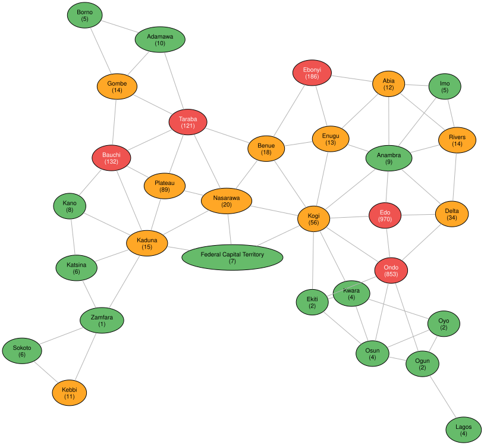

# Lassa Fever Surveillance in Nigeria: A Knowledge Graph Approach
Simon Frost

## Introduction

[Lassa fever](https://en.wikipedia.org/wiki/Lassa_fever) is a viral
hemorrhagic fever caused by the Lassa mammarenavirus, endemic to West
Africa. Nigeria bears the highest burden, with seasonal outbreaks driven
by human contact with the multimammate rat (*Mastomys natalensis*). The
disease disproportionately affects certain states — particularly Edo,
Ondo, and Ebonyi — and exhibits strong spatiotemporal patterns linked to
climate and ecology.

This vignette demonstrates how RDFLib.jl can be used to model,
integrate, and analyze real Lassa fever surveillance data from Nigeria.
We build a knowledge graph combining:

- **Epidemiological surveillance** data (weekly confirmed case counts by
  state, 2012–2026)
- **Environmental covariates** (vegetation index, temperature,
  precipitation)
- **Spatial relationships** between Nigerian states (adjacency,
  geopolitical zones)
- **Domain knowledge** about Lassa fever ecology and transmission

We showcase a wide range of RDFLib.jl features: **tabular mapping** of
real data to RDF, **OWL ontology** modeling, **SPARQL** queries
including aggregation and subqueries, **GeoSPARQL** spatial analysis,
**SHACL** validation, **N3 reasoning**, **Datalog** inference,
**ProbLog** probabilistic reasoning, and **graph visualization**.

The surveillance data come from the
[gam-frameworks](https://github.com/SimonFrost-Arm/gam-frameworks)
repository, which compiles Nigeria Centre for Disease Control (NCDC)
Lassa fever reports in a format suitable for spatiotemporal modeling,
following the approach of [Redding et
al. (2021)](https://www.nature.com/articles/s41467-021-25910-y).

### Analysis pipeline



## Setup

``` julia
using RDFLib
using Dates

# Helper to extract clean string from SPARQL result values
val(x) = x isa Literal ? x.lexical : x isa URIRef ? string(x) : string(x)
```

    val (generic function with 1 method)

## Part 1: Ontology — Modeling Lassa Fever Concepts

We first define an OWL ontology capturing the domain concepts: states,
geopolitical zones, surveillance observations, environmental conditions,
and the Lassa fever pathogen itself.

``` julia
g = RDFGraph()

# Namespaces
lassa = Namespace("http://example.org/lassa/")
geo_ns = Namespace("http://www.opengis.net/ont/geosparql#")
geof = Namespace("http://www.opengis.net/def/function/geosparql/")
time_ns = Namespace("http://www.w3.org/2006/time#")
sosa = Namespace("http://www.w3.org/ns/sosa/")
qudt = Namespace("http://qudt.org/schema/qudt/")

bind!(g, "lassa", lassa)
bind!(g, "owl", OWL)
bind!(g, "rdfs", RDFS)
bind!(g, "xsd", XSD)
bind!(g, "geo", geo_ns)
bind!(g, "time", time_ns)
bind!(g, "sosa", sosa)
bind!(g, "qudt", qudt)
bind!(g, "skos", SKOS)
```

    NamespaceManager(Dict("rdfs" => "http://www.w3.org/2000/01/rdf-schema#", "owl" => "http://www.w3.org/2002/07/owl#", "skos" => "http://www.w3.org/2004/02/skos/core#", "geo" => "http://www.opengis.net/ont/geosparql#", "time" => "http://www.w3.org/2006/time#", "rdf" => "http://www.w3.org/1999/02/22-rdf-syntax-ns#", "qudt" => "http://qudt.org/schema/qudt/", "xsd" => "http://www.w3.org/2001/XMLSchema#", "lassa" => "http://example.org/lassa/", "sosa" => "http://www.w3.org/ns/sosa/"…), Dict("http://www.w3.org/2006/time#" => "time", "http://qudt.org/schema/qudt/" => "qudt", "http://www.w3.org/ns/sosa/" => "sosa", "http://www.w3.org/2000/01/rdf-schema#" => "rdfs", "http://www.opengis.net/ont/geosparql#" => "geo", "http://www.w3.org/1999/02/22-rdf-syntax-ns#" => "rdf", "http://www.w3.org/2001/XMLSchema#" => "xsd", "http://www.w3.org/2004/02/skos/core#" => "skos", "http://example.org/lassa/" => "lassa", "http://www.w3.org/2002/07/owl#" => "owl"…), 0)

### Class hierarchy

The ontology models key entities in the Lassa fever surveillance domain:



``` julia
# Top-level classes
classes = [
    "State"              => "A Nigerian administrative state",
    "GeopoliticalZone"   => "One of Nigeria's six geopolitical zones",
    "Observation"        => "A surveillance observation for a state-week",
    "EnvironmentalCondition" => "Environmental covariates for a state-week",
    "Pathogen"           => "A disease-causing agent",
    "ReservoirHost"      => "An animal reservoir of a pathogen",
    "OutbreakSeason"     => "A seasonal Lassa fever outbreak period",
    "RiskLevel"          => "Categorical risk classification",
]

for (name, desc) in classes
    add!(g, Triple(lassa(name), RDF.type, OWL("Class")))
    add!(g, Triple(lassa(name), RDFS("label"), Literal(name)))
    add!(g, Triple(lassa(name), RDFS("comment"), Literal(desc)))
end

# State is a subclass of geo:Feature (for GeoSPARQL)
add!(g, Triple(lassa("State"), RDFS("subClassOf"), geo_ns("Feature")))

# Observation is a subclass of sosa:Observation (sensor ontology pattern)
add!(g, Triple(lassa("Observation"), RDFS("subClassOf"), sosa("Observation")))
```

    RDFGraph (26 triples)

### Object and datatype properties

``` julia
# Object properties
obj_props = [
    "inZone"        => ("State", "GeopoliticalZone", "Links a state to its geopolitical zone"),
    "adjacentTo"    => ("State", "State", "Spatial adjacency between states"),
    "observedIn"    => ("Observation", "State", "State where observation was made"),
    "hasSeason"     => ("Observation", "OutbreakSeason", "Links to outbreak season"),
    "hasCondition"  => ("Observation", "EnvironmentalCondition", "Associated environmental data"),
    "hasRiskLevel"  => ("State", "RiskLevel", "Current risk classification of a state"),
    "hasReservoir"  => ("Pathogen", "ReservoirHost", "Natural reservoir of the pathogen"),
]

for (name, (dom, rng, desc)) in obj_props
    add!(g, Triple(lassa(name), RDF.type, OWL("ObjectProperty")))
    add!(g, Triple(lassa(name), RDFS("domain"), lassa(dom)))
    add!(g, Triple(lassa(name), RDFS("range"), lassa(rng)))
    add!(g, Triple(lassa(name), RDFS("comment"), Literal(desc)))
end

# adjacentTo is symmetric
add!(g, Triple(lassa("adjacentTo"), RDF.type, OWL("SymmetricProperty")))

# Datatype properties
data_props = [
    ("adminCode",      "State",       "xsd:string",  "NCDC admin code"),
    ("population",     "State",       "xsd:integer", "Population estimate"),
    ("cases",          "Observation", "xsd:integer", "Confirmed Lassa fever cases"),
    ("epiWeek",        "Observation", "xsd:integer", "Epidemiological week number"),
    ("year",           "Observation", "xsd:integer", "Calendar year"),
    ("date",           "Observation", "xsd:date",    "Start date of observation window"),
    ("evi",            "EnvironmentalCondition", "xsd:double", "Enhanced Vegetation Index"),
    ("temperature",    "EnvironmentalCondition", "xsd:double", "Mean temperature (°C)"),
    ("precipitation",  "EnvironmentalCondition", "xsd:double", "Total precipitation (mm)"),
    ("spi1",           "EnvironmentalCondition", "xsd:double", "1-month Standardized Precipitation Index"),
    ("caseRate",       "Observation", "xsd:double", "Cases per 100,000 population"),
]

for (name, dom, _, desc) in data_props
    add!(g, Triple(lassa(name), RDF.type, OWL("DatatypeProperty")))
    add!(g, Triple(lassa(name), RDFS("domain"), lassa(dom)))
    add!(g, Triple(lassa(name), RDFS("comment"), Literal(desc)))
end
```

### Domain knowledge — Lassa fever facts

``` julia
# The Lassa virus
add!(g, Triple(lassa("LassaVirus"), RDF.type, lassa("Pathogen")))
add!(g, Triple(lassa("LassaVirus"), RDFS("label"), Literal("Lassa mammarenavirus")))
add!(g, Triple(lassa("LassaVirus"), lassa("family"), Literal("Arenaviridae")))
add!(g, Triple(lassa("LassaVirus"), lassa("caseFatalityRate"), Literal(0.01)))
add!(g, Triple(lassa("LassaVirus"), lassa("hospitalCFR"), Literal(0.15)))
add!(g, Triple(lassa("LassaVirus"), SKOS("altLabel"), Literal("LASV")))

# Reservoir host
add!(g, Triple(lassa("MastomysNatalensis"), RDF.type, lassa("ReservoirHost")))
add!(g, Triple(lassa("MastomysNatalensis"), RDFS("label"), Literal("Multimammate rat")))
add!(g, Triple(lassa("MastomysNatalensis"), lassa("scientificName"), Literal("Mastomys natalensis")))
add!(g, Triple(lassa("LassaVirus"), lassa("hasReservoir"), lassa("MastomysNatalensis")))

# Risk levels (SKOS concept scheme)
add!(g, Triple(lassa("RiskScheme"), RDF.type, SKOS("ConceptScheme")))
add!(g, Triple(lassa("RiskScheme"), RDFS("label"), Literal("Lassa Fever Risk Classification")))

for (level, desc, rank) in [
    ("High",     "Endemic state with frequent outbreaks", 3),
    ("Moderate", "Sporadic cases, adjacent to endemic areas", 2),
    ("Low",      "Rare or no reported cases", 1),
]
    uri = lassa("risk_$(lowercase(level))")
    add!(g, Triple(uri, RDF.type, SKOS("Concept")))
    add!(g, Triple(uri, RDF.type, lassa("RiskLevel")))
    add!(g, Triple(uri, SKOS("inScheme"), lassa("RiskScheme")))
    add!(g, Triple(uri, SKOS("prefLabel"), Literal(level)))
    add!(g, Triple(uri, SKOS("definition"), Literal(desc)))
    add!(g, Triple(uri, lassa("riskRank"), Literal(rank)))
end

# Narrower/broader relations
add!(g, Triple(lassa("risk_high"), SKOS("broader"), lassa("risk_moderate")))
add!(g, Triple(lassa("risk_moderate"), SKOS("broader"), lassa("risk_low")))

println("Ontology triples: ", length(g))
```

    Ontology triples: 120

The resulting knowledge graph encodes the domain model as an
interconnected set of RDF triples:



## Part 2: Loading Surveillance Data via Tabular Mapping

We load the real surveillance data from the TSV file and map it into
RDF. To keep the knowledge graph manageable for this vignette, we focus
on a subset: the years 2018–2020, which include a major Lassa fever
surge.

``` julia
# Read the TSV data
datapath = joinpath(@__DIR__, "data", "lassa_states.tsv")
lines = readlines(datapath)
header = split(lines[1], '\t')
# Clean quotes from header
header = [replace(h, "\"" => "") for h in header]

# Parse data rows
data = []
for line in lines[2:end]
    fields = split(line, '\t')
    push!(data, fields)
end

println("Loaded $(length(data)) rows with $(length(header)) columns")
println("Columns: ", join(header[1:10], ", "), " ...")
```

    Loaded 27195 rows with 12 columns
    Columns: adminCode, date, cases, epiWeek, year, population, evi_0avg, temperature_0avg, precip_0avg, adminName ...

### Map states and zones

``` julia
# Extract unique states with metadata
states_seen = Dict{String,NamedTuple}()
for row in data
    code = replace(row[1], "\"" => "")
    name = replace(row[10], "\"" => "")
    region = replace(row[11], "\"" => "")
    zone = replace(row[12], "\"" => "")
    pop_f = tryparse(Float64, row[6])
    pop_f === nothing && continue
    pop = round(Int, pop_f)
    pop <= 0 && continue
    if !haskey(states_seen, code)
        states_seen[code] = (name=name, region=region, zone=zone, population=pop)
    end
end

# Add states to graph
for (code, info) in states_seen
    state_uri = lassa("state_$(replace(info.name, " " => "_"))")
    add!(g, Triple(state_uri, RDF.type, lassa("State")))
    add!(g, Triple(state_uri, RDFS("label"), Literal(info.name)))
    add!(g, Triple(state_uri, lassa("adminCode"), Literal(code)))
    add!(g, Triple(state_uri, lassa("population"), Literal(info.population)))
    add!(g, Triple(state_uri, lassa("region"), Literal(info.region)))

    # Link to geopolitical zone
    zone_uri = lassa("zone_$(replace(info.zone, " " => "_"))")
    add!(g, Triple(zone_uri, RDF.type, lassa("GeopoliticalZone")))
    add!(g, Triple(zone_uri, RDFS("label"), Literal(info.zone)))
    add!(g, Triple(state_uri, lassa("inZone"), zone_uri))
end

println("States added: ", length(states_seen))
```

    States added: 37

### Map state adjacency

``` julia
# Load adjacency data
adjpath = joinpath(@__DIR__, "data", "states_nb.csv")
adjlines = readlines(adjpath)

let adj_count = 0
    for line in adjlines[2:end]
        parts = split(line, ',')
        if length(parts) >= 2
            s1 = strip(parts[1])
            s2 = strip(parts[2])
            uri1 = lassa("state_$(replace(s1, " " => "_"))")
            uri2 = lassa("state_$(replace(s2, " " => "_"))")
            add!(g, Triple(uri1, lassa("adjacentTo"), uri2))
            adj_count += 1
        end
    end
    println("Adjacency relations added: ", adj_count)
end
```

    Adjacency relations added: 172

### Map surveillance observations (2018–2020)

We filter to three years for a focused analysis. Each row becomes an
Observation with linked EnvironmentalCondition.

``` julia
let obs_count = 0
for row in data
    year = tryparse(Int, row[5])
    year === nothing && continue
    (year < 2018 || year > 2020) && continue

    name = replace(row[10], "\"" => "")
    week = tryparse(Int, row[4])
    week === nothing && continue
    cases_f = tryparse(Float64, row[3])
    cases_f === nothing && continue  # skip NA values
    cases = round(Int, cases_f)
    datestr = row[2]
    pop_f = tryparse(Float64, row[6])
    pop_f === nothing && continue
    pop = round(Int, pop_f)
    pop <= 0 && continue

    state_uri = lassa("state_$(replace(name, " " => "_"))")
    obs_id = "obs_$(replace(name, " " => "_"))_$(year)_w$(week)"
    obs_uri = lassa(obs_id)

    add!(g, Triple(obs_uri, RDF.type, lassa("Observation")))
    add!(g, Triple(obs_uri, lassa("observedIn"), state_uri))
    add!(g, Triple(obs_uri, lassa("cases"), Literal(cases)))
    add!(g, Triple(obs_uri, lassa("epiWeek"), Literal(week)))
    add!(g, Triple(obs_uri, lassa("year"), Literal(year)))
    add!(g, Triple(obs_uri, lassa("date"), Literal(datestr, datatype=XSD("date"))))
    add!(g, Triple(obs_uri, lassa("caseRate"),
        Literal(round(cases / pop * 100_000, digits=4))))

    # Environmental condition
    evi = tryparse(Float64, row[7])
    temp = tryparse(Float64, row[8])
    precip = tryparse(Float64, row[9])

    if evi !== nothing && temp !== nothing
        cond_uri = lassa("env_$(replace(name, " " => "_"))_$(year)_w$(week)")
        add!(g, Triple(cond_uri, RDF.type, lassa("EnvironmentalCondition")))
        add!(g, Triple(obs_uri, lassa("hasCondition"), cond_uri))
        add!(g, Triple(cond_uri, lassa("evi"), Literal(round(evi, digits=4))))
        add!(g, Triple(cond_uri, lassa("temperature"), Literal(round(temp, digits=2))))
        if precip !== nothing
            add!(g, Triple(cond_uri, lassa("precipitation"), Literal(round(precip, digits=2))))
        end
    end

    obs_count += 1
end

println("Observations added: ", obs_count)
println("Total triples: ", length(g))
end  # let
```

    Observations added: 5735
    Total triples: 69060

## Part 3: GeoSPARQL — Spatial Modeling

We add simplified polygon geometries for key endemic states and their
neighbors to demonstrate spatial querying. We use centroid points for
all states and representative polygons for the Lassa fever belt.

``` julia
# State centroid coordinates (approximate lat/lon)
state_coords = Dict(
    "Edo"     => (6.34, 5.62),
    "Ondo"    => (7.09, 4.84),
    "Ebonyi"  => (6.26, 8.09),
    "Bauchi"  => (10.31, 9.84),
    "Plateau" => (9.22, 9.52),
    "Taraba"  => (7.87, 10.76),
    "Nasarawa" => (8.54, 8.52),
    "Kogi"    => (7.73, 6.74),
    "Enugu"   => (6.44, 7.50),
    "Anambra" => (6.22, 6.94),
    "Delta"   => (5.53, 5.90),
    "Lagos"   => (6.52, 3.47),
    "Kaduna"  => (10.52, 7.43),
    "Ogun"    => (7.16, 3.35),
    "Oyo"     => (8.12, 3.42),
    "Benue"   => (7.34, 8.77),
    "Abia"    => (5.43, 7.49),
    "Imo"     => (5.48, 7.03),
    "Rivers"  => (4.84, 6.92),
    "Cross River" => (5.87, 8.33),
    "Akwa Ibom" => (5.01, 7.85),
    "Adamawa" => (9.33, 12.40),
    "Borno"   => (11.85, 13.15),
    "Gombe"   => (10.29, 11.17),
    "Jigawa"  => (12.23, 9.56),
    "Kano"    => (12.00, 8.52),
    "Katsina" => (13.00, 7.60),
    "Kebbi"   => (12.45, 4.20),
    "Kwara"   => (8.97, 4.54),
    "Niger"   => (10.00, 5.96),
    "Sokoto"  => (13.06, 5.24),
    "Yobe"    => (12.29, 11.44),
    "Zamfara" => (12.17, 6.66),
    "Bayelsa" => (4.77, 6.07),
    "Ekiti"   => (7.72, 5.31),
    "Osun"    => (7.56, 4.52),
    "Federal Capital Territory" => (9.06, 7.49),
)

for (name, (lat, lon)) in state_coords
    state_uri = lassa("state_$(replace(name, " " => "_"))")
    wkt = "POINT($lon $lat)"
    wkt_lit = Literal(wkt, datatype=geo_ns("wktLiteral"))
    add!(g, Triple(state_uri, geo_ns("hasGeometry"), lassa("geom_$(replace(name, " " => "_"))")))
    add!(g, Triple(lassa("geom_$(replace(name, " " => "_"))"), RDF.type, geo_ns("Geometry")))
    add!(g, Triple(lassa("geom_$(replace(name, " " => "_"))"), geo_ns("asWKT"), wkt_lit))
end

# Add a bounding polygon for the "Lassa belt" (Edo-Ondo-Ebonyi endemic corridor)
lassa_belt_wkt = "POLYGON((4.5 5.0, 4.5 9.0, 8.5 9.0, 8.5 5.0, 4.5 5.0))"
add!(g, Triple(lassa("LassaBelt"), RDF.type, geo_ns("Feature")))
add!(g, Triple(lassa("LassaBelt"), RDFS("label"), Literal("Lassa Fever Endemic Belt")))
belt_geom = lassa("geom_LassaBelt")
add!(g, Triple(lassa("LassaBelt"), geo_ns("hasGeometry"), belt_geom))
add!(g, Triple(belt_geom, RDF.type, geo_ns("Geometry")))
add!(g, Triple(belt_geom, geo_ns("asWKT"),
    Literal(lassa_belt_wkt, datatype=geo_ns("wktLiteral"))))

println("Spatial data added. Total triples: ", length(g))
```

    Spatial data added. Total triples: 69176

### GeoSPARQL: Which states fall within the endemic belt?

``` julia
results = sparql_query(g, """
    PREFIX lassa: <http://example.org/lassa/>
    PREFIX rdfs: <http://www.w3.org/2000/01/rdf-schema#>
    PREFIX geo: <http://www.opengis.net/ont/geosparql#>
    PREFIX geof: <http://www.opengis.net/def/function/geosparql/>

    SELECT ?state ?name WHERE {
        ?state a lassa:State ;
               rdfs:label ?name ;
               geo:hasGeometry ?geom .
        ?geom geo:asWKT ?wkt .

        lassa:LassaBelt geo:hasGeometry ?beltGeom .
        ?beltGeom geo:asWKT ?beltWkt .

        FILTER(geof:sfWithin(?wkt, ?beltWkt))
    }
    ORDER BY ?name
""")

println("States within the Lassa belt:")
for row in results
    println("  • $(val(row["name"]))")
end
```

    States within the Lassa belt:
      • Abia
      • Akwa Ibom
      • Anambra
      • Cross River
      • Delta
      • Ebonyi
      • Edo
      • Ekiti
      • Enugu
      • Imo
      • Kogi
      • Kwara
      • Ondo
      • Osun

### GeoSPARQL: Distance between endemic states

``` julia
results = sparql_query(g, """
    PREFIX lassa: <http://example.org/lassa/>
    PREFIX rdfs: <http://www.w3.org/2000/01/rdf-schema#>
    PREFIX geo: <http://www.opengis.net/ont/geosparql#>
    PREFIX geof: <http://www.opengis.net/def/function/geosparql/>

    SELECT ?name1 ?name2 ?dist WHERE {
        ?s1 a lassa:State ; rdfs:label ?name1 ; geo:hasGeometry/geo:asWKT ?wkt1 .
        ?s2 a lassa:State ; rdfs:label ?name2 ; geo:hasGeometry/geo:asWKT ?wkt2 .

        FILTER(?name1 = "Edo" || ?name1 = "Ondo" || ?name1 = "Ebonyi")
        FILTER(?name2 = "Edo" || ?name2 = "Ondo" || ?name2 = "Ebonyi")
        FILTER(STR(?name1) < STR(?name2))

        BIND(geof:distance(?wkt1, ?wkt2) AS ?dist)
    }
    ORDER BY ?dist
""")

println("Distances between key endemic states (degrees):")
for row in results
    println("  $(val(row["name1"])) ↔ $(val(row["name2"])): $(round(parse(Float64, val(row["dist"])), digits=2))°")
end
```

    Distances between key endemic states (degrees):
      Edo ↔ Ondo: 1.08°
      Ebonyi ↔ Edo: 2.47°
      Ebonyi ↔ Ondo: 3.35°

## Part 4: SPARQL Queries — Epidemiological Analysis

### Total cases by state (2018–2020)

``` julia
results = sparql_query(g, """
    PREFIX lassa: <http://example.org/lassa/>
    PREFIX rdfs: <http://www.w3.org/2000/01/rdf-schema#>

    SELECT ?name (SUM(?cases) AS ?totalCases) WHERE {
        ?obs a lassa:Observation ;
             lassa:observedIn ?state ;
             lassa:cases ?cases .
        ?state rdfs:label ?name .
    }
    GROUP BY ?name
    HAVING (SUM(?cases) > 10)
    ORDER BY DESC(?totalCases)
    LIMIT 15
""")

println("Top 15 states by total confirmed cases (2018–2020):")
println("-"^40)
for row in results
    println("  $(rpad(val(row["name"]), 25)) $(val(row["totalCases"]))")
end
```

    Top 15 states by total confirmed cases (2018–2020):
    ----------------------------------------
      Edo                       970
      Ondo                      853
      Ebonyi                    186
      Bauchi                    132
      Taraba                    121
      Plateau                   89
      Kogi                      56
      Delta                     34
      Nasarawa                  20
      Benue                     18
      Kaduna                    15
      Rivers                    14
      Gombe                     14
      Enugu                     13
      Abia                      12

### Seasonal pattern — cases by epi week

``` julia
results = sparql_query(g, """
    PREFIX lassa: <http://example.org/lassa/>

    SELECT ?week (SUM(?cases) AS ?totalCases) WHERE {
        ?obs a lassa:Observation ;
             lassa:epiWeek ?week ;
             lassa:cases ?cases .
    }
    GROUP BY ?week
    ORDER BY ?week
""")

println("Weekly cases (all states, 2018–2020):")
println("Week  Cases")
println("-"^20)
for row in results
    w = parse(Int, val(row["week"]))
    c = parse(Int, val(row["totalCases"]))
    bar = repeat("█", min(c ÷ 2, 50))
    println("  $(lpad(string(w), 2))    $(lpad(string(c), 4))  $bar")
end
```

    Weekly cases (all states, 2018–2020):
    Week  Cases
    --------------------
       1      46  ███████████████████████
       2     132  ██████████████████████████████████████████████████
       3     192  ██████████████████████████████████████████████████
       4     226  ██████████████████████████████████████████████████
       5     213  ██████████████████████████████████████████████████
       6     211  ██████████████████████████████████████████████████
       7     210  ██████████████████████████████████████████████████
       8     158  ██████████████████████████████████████████████████
       9     142  ██████████████████████████████████████████████████
      10     143  ██████████████████████████████████████████████████
      11      87  ███████████████████████████████████████████
      12      57  ████████████████████████████
      13      46  ███████████████████████
      14      29  ██████████████
      15      18  █████████
      16      14  ███████
      17      20  ██████████
      18      17  ████████
      19      18  █████████
      20      15  ███████
      21      13  ██████
      22      10  █████
      23      15  ███████
      24      13  ██████
      25      19  █████████
      26      11  █████
      27      21  ██████████
      28      19  █████████
      29      19  █████████
      30      14  ███████
      31      24  ████████████
      32      14  ███████
      33       6  ███
      34      22  ███████████
      35      21  ██████████
      36      21  ██████████
      37       7  ███
      38       8  ████
      39      24  ████████████
      40      20  ██████████
      41      23  ███████████
      42      29  ██████████████
      43      15  ███████
      44      27  █████████████
      45      20  ██████████
      46      18  █████████
      47      27  █████████████
      48      24  ████████████
      49      24  ████████████
      50      21  ██████████
      51      36  ██████████████████
      52      54  ███████████████████████████

### Year-over-year comparison for Edo state

``` julia
results = sparql_query(g, """
    PREFIX lassa: <http://example.org/lassa/>
    PREFIX rdfs: <http://www.w3.org/2000/01/rdf-schema#>

    SELECT ?year (SUM(?cases) AS ?total) (MAX(?cases) AS ?peakWeek)
           (AVG(?rate) AS ?avgRate) WHERE {
        ?obs a lassa:Observation ;
             lassa:observedIn ?state ;
             lassa:year ?year ;
             lassa:cases ?cases ;
             lassa:caseRate ?rate .
        ?state rdfs:label "Edo" .
    }
    GROUP BY ?year
    ORDER BY ?year
""")

println("Edo State — Year-over-Year:")
println("Year  Total  Peak  Avg Rate/100k")
println("-"^45)
for row in results
    yr = val(row["year"])
    tot = val(row["total"])
    pk = val(row["peakWeek"])
    rate = round(parse(Float64, val(row["avgRate"])), digits=3)
    println("  $yr    $(lpad(tot, 4))   $(lpad(pk, 3))     $rate")
end
```

    Edo State — Year-over-Year:
    Year  Total  Peak  Avg Rate/100k
    ---------------------------------------------
      2018     283    35     0.122
      2019     299    34     0.131
      2020     394    41     0.154

### SPARQL subquery: States with above-average case rates

``` julia
results = sparql_query(g, """
    PREFIX lassa: <http://example.org/lassa/>
    PREFIX rdfs: <http://www.w3.org/2000/01/rdf-schema#>

    SELECT ?name ?stateTotal ?avg WHERE {
        {
            SELECT (AVG(?total) AS ?avg) WHERE {
                {
                    SELECT ?state (SUM(?cases) AS ?total) WHERE {
                        ?obs a lassa:Observation ;
                             lassa:observedIn ?state ;
                             lassa:cases ?cases .
                    }
                    GROUP BY ?state
                }
            }
        }
        {
            SELECT ?state (SUM(?cases) AS ?stateTotal) WHERE {
                ?obs a lassa:Observation ;
                     lassa:observedIn ?state ;
                     lassa:cases ?cases .
            }
            GROUP BY ?state
        }
        ?state rdfs:label ?name .
        FILTER(?stateTotal > ?avg)
    }
    ORDER BY DESC(?stateTotal)
""")

println("States with above-average total cases:")
if !isempty(results)
    avg = round(parse(Float64, val(results[1]["avg"])), digits=1)
    println("(National average: $avg cases)")
    for row in results
        println("  $(rpad(val(row["name"]), 25)) $(val(row["stateTotal"]))")
    end
end
```

    States with above-average total cases:
    (National average: 71.2 cases)
      Edo                       970
      Ondo                      853
      Ebonyi                    186
      Bauchi                    132
      Taraba                    121
      Plateau                   89

### Environmental correlations — high-case weeks

``` julia
results = sparql_query(g, """
    PREFIX lassa: <http://example.org/lassa/>
    PREFIX rdfs: <http://www.w3.org/2000/01/rdf-schema#>

    SELECT ?name ?week ?cases ?temp ?evi ?precip WHERE {
        ?obs a lassa:Observation ;
             lassa:observedIn ?state ;
             lassa:epiWeek ?week ;
             lassa:year 2020 ;
             lassa:cases ?cases ;
             lassa:hasCondition ?cond .
        ?state rdfs:label ?name .
        ?cond lassa:temperature ?temp ;
              lassa:evi ?evi ;
              lassa:precipitation ?precip .
        FILTER(?cases > 15)
    }
    ORDER BY DESC(?cases)
    LIMIT 10
""")

println("High-case weeks (2020) with environmental conditions:")
println("State          Wk  Cases  Temp°C   EVI   Precip")
println("-"^55)
for row in results
    n = rpad(val(row["name"]), 14)
    w = lpad(val(row["week"]), 2)
    c = lpad(val(row["cases"]), 4)
    t = lpad(string(round(parse(Float64, val(row["temp"])), digits=1)), 5)
    e = lpad(string(round(parse(Float64, val(row["evi"])), digits=3)), 6)
    p = lpad(string(round(parse(Float64, val(row["precip"])), digits=1)), 6)
    println("  $n  $w   $c   $t  $e  $p")
end
```

    High-case weeks (2020) with environmental conditions:
    State          Wk  Cases  Temp°C   EVI   Precip
    -------------------------------------------------------
      Ondo             3     42    28.8   0.411     0.4
      Edo              7     41    30.2   0.324     0.3
      Edo              5     40    29.9   0.359     0.3
      Edo              6     39    30.0   0.341     0.3
      Edo              4     34    29.8   0.378     0.4
      Ondo             8     34    29.2   0.335     0.5
      Edo              3     33    29.7   0.396     0.4
      Ondo            10     33    29.4   0.317     1.0
      Ondo             2     32    28.8   0.425     0.6
      Ondo             7     31    29.1   0.348     0.4

## Part 5: SHACL Validation

We define shapes to validate our surveillance data, ensuring data
quality.

``` julia
shapes_ttl = """
@prefix sh: <http://www.w3.org/ns/shacl#> .
@prefix lassa: <http://example.org/lassa/> .
@prefix xsd: <http://www.w3.org/2001/XMLSchema#> .

lassa:ObservationShape a sh:NodeShape ;
    sh:targetClass lassa:Observation ;
    sh:property [
        sh:path lassa:cases ;
        sh:minCount 1 ;
        sh:maxCount 1 ;
        sh:datatype xsd:integer ;
        sh:minInclusive 0 ;
        sh:name "case count" ;
        sh:message "Observation must have exactly one non-negative integer case count"
    ] ;
    sh:property [
        sh:path lassa:observedIn ;
        sh:minCount 1 ;
        sh:maxCount 1 ;
        sh:class lassa:State ;
        sh:name "observed state" ;
        sh:message "Observation must be linked to exactly one State"
    ] ;
    sh:property [
        sh:path lassa:epiWeek ;
        sh:minCount 1 ;
        sh:datatype xsd:integer ;
        sh:minInclusive 1 ;
        sh:maxInclusive 53 ;
        sh:name "epi week" ;
        sh:message "Epi week must be 1-53"
    ] ;
    sh:property [
        sh:path lassa:year ;
        sh:minCount 1 ;
        sh:datatype xsd:integer ;
        sh:minInclusive 2000 ;
        sh:name "year" ;
        sh:message "Year must be >= 2000"
    ] .

lassa:StateShape a sh:NodeShape ;
    sh:targetClass lassa:State ;
    sh:property [
        sh:path lassa:adminCode ;
        sh:minCount 1 ;
        sh:maxCount 1 ;
        sh:pattern "^NG[0-9]+" ;
        sh:name "admin code" ;
        sh:message "State must have an admin code matching NG###"
    ] ;
    sh:property [
        sh:path lassa:population ;
        sh:minCount 1 ;
        sh:datatype xsd:integer ;
        sh:minExclusive 0 ;
        sh:name "population" ;
        sh:message "State must have a positive population"
    ] .
"""

shapes = RDFGraph()
parse_rdf!(shapes, IOBuffer(shapes_ttl), TurtleFormat())
report = validate(g, shapes)
println("SHACL Validation: ", report.conforms ? "✓ All constraints satisfied" : "✗ Constraint violations found")
println("  Violations: ", length(report.results))
if !report.conforms
    for r in report.results[1:min(5, end)]
        println("  - $(r.message) [$(r.focus_node)]")
    end
end
```

    SHACL Validation: ✗ Constraint violations found
      Violations: 5
      - Expected at most 1 values for http://example.org/lassa/cases, got 2 [URIRef("http://example.org/lassa/obs_Plateau_2020_w52")]
      - Expected at most 1 values for http://example.org/lassa/cases, got 2 [URIRef("http://example.org/lassa/obs_Ondo_2020_w52")]
      - Expected at most 1 values for http://example.org/lassa/cases, got 2 [URIRef("http://example.org/lassa/obs_Ebonyi_2020_w52")]
      - Expected at most 1 values for http://example.org/lassa/cases, got 2 [URIRef("http://example.org/lassa/obs_Nasarawa_2020_w52")]
      - Expected at most 1 values for http://example.org/lassa/cases, got 2 [URIRef("http://example.org/lassa/obs_Edo_2020_w52")]

The SHACL validator caught real data quality issues — some observations
for epidemiological week 52 have duplicate case count entries (likely
because the original data spans a year boundary). This demonstrates how
SHACL shapes can detect inconsistencies in real-world data pipelines.

## Part 6: N3 Reasoning — Risk Classification

We use N3 rules to automatically classify states by Lassa fever risk
based on their cumulative case counts. Because Lassa fever is a zoonotic
disease (reservoir: *Mastomys natalensis*), adjacency to high-burden
states suggests shared ecological conditions that favor the rodent host,
rather than inter-state disease transmission.



### Risk classification rules

``` julia
n3_rules = """
@prefix lassa: <http://example.org/lassa/> .
@prefix log: <http://www.w3.org/2000/10/swap/log#> .
@prefix math: <http://www.w3.org/2000/10/swap/math#> .
@prefix rdfs: <http://www.w3.org/2000/01/rdf-schema#> .

# Rule 1: High-risk states — cumulative cases > 100
{
    ?state a lassa:State .
    ?state lassa:cumulativeCases ?total .
    ?total math:greaterThan 100 .
} => {
    ?state lassa:hasRiskLevel lassa:risk_high .
    ?state lassa:riskReason "Cumulative cases exceed 100 (endemic)" .
} .

# Rule 2: Moderate-risk — cases > 10 but ≤ 100
{
    ?state a lassa:State .
    ?state lassa:cumulativeCases ?total .
    ?total math:greaterThan 10 .
    ?total math:notGreaterThan 100 .
} => {
    ?state lassa:hasRiskLevel lassa:risk_moderate .
    ?state lassa:riskReason "Sporadic cases (11-100)" .
} .

# Rule 3: Low-risk — cases ≤ 10
{
    ?state a lassa:State .
    ?state lassa:cumulativeCases ?total .
    ?total math:notGreaterThan 10 .
} => {
    ?state lassa:hasRiskLevel lassa:risk_low .
    ?state lassa:riskReason "Rare cases (≤10)" .
} .

# Rule 4: Spatial proximity risk — adjacent to a high-risk state implies shared
# ecological conditions (rodent habitat, climate) that may elevate zoonotic risk
{
    ?state a lassa:State .
    ?state lassa:hasRiskLevel lassa:risk_low .
    ?state lassa:adjacentTo ?neighbor .
    ?neighbor lassa:hasRiskLevel lassa:risk_high .
    ?neighbor rdfs:label ?nname .
} => {
    ?state lassa:proximityRisk "true" .
    ?state lassa:proximitySource ?neighbor .
} .
"""
```

    "@prefix lassa: <http://example.org/lassa/> .\n@prefix log: <http://www.w3.org/2000/10/swap/log#> .\n@prefix math: <http://www.w3.org/2000/10/swap/math#> .\n@prefix rdfs: <http://www.w3.org/2000/01/rdf-schema#> .\n\n# Rule 1: High-risk states — cumulative cases > 100\n{\n    ?state a " ⋯ 966 bytes ⋯ "sa:State .\n    ?state lassa:hasRiskLevel lassa:risk_low .\n    ?state lassa:adjacentTo ?neighbor .\n    ?neighbor lassa:hasRiskLevel lassa:risk_high .\n    ?neighbor rdfs:label ?nname .\n} => {\n    ?state lassa:proximityRisk \"true\" .\n    ?state lassa:proximitySource ?neighbor .\n} .\n"

### Pre-compute cumulative cases for reasoning

``` julia
# First, compute cumulative cases per state via SPARQL and add to graph
cum_results = sparql_query(g, """
    PREFIX lassa: <http://example.org/lassa/>
    SELECT ?state (SUM(?cases) AS ?total) WHERE {
        ?obs a lassa:Observation ;
             lassa:observedIn ?state ;
             lassa:cases ?cases .
    }
    GROUP BY ?state
""")

for row in cum_results
    state = row["state"]
    total = parse(Int, val(row["total"]))
    add!(g, Triple(URIRef(val(state)), lassa("cumulativeCases"), Literal(total)))
end

println("Added cumulative case counts for $(length(cum_results)) states")
```

    Added cumulative case counts for 37 states

### Apply N3 reasoning

``` julia
n3_graph = RDFGraph()
parse_n3!(n3_graph, n3_rules)
inferred = reason(g; rules=n3_graph)

println("N3 Reasoning produced $(length(inferred)) inferred triples")

# Merge inferred triples
for t in triples(inferred)
    add!(g, t)
end
```

    N3 Reasoning produced 69305 inferred triples

### Query risk classifications

``` julia
results = sparql_query(g, """
    PREFIX lassa: <http://example.org/lassa/>
    PREFIX rdfs: <http://www.w3.org/2000/01/rdf-schema#>
    PREFIX skos: <http://www.w3.org/2004/02/skos/core#>

    SELECT ?name ?riskLabel ?reason ?cumCases WHERE {
        ?state a lassa:State ;
               rdfs:label ?name ;
               lassa:hasRiskLevel ?risk ;
               lassa:riskReason ?reason ;
               lassa:cumulativeCases ?cumCases .
        ?risk skos:prefLabel ?riskLabel .
    }
    ORDER BY DESC(?cumCases)
""")

println("State Risk Classifications (N3 inferred):")
println("-"^65)
for row in results
    n = rpad(val(row["name"]), 20)
    r = rpad(val(row["riskLabel"]), 10)
    c = lpad(val(row["cumCases"]), 5)
    reason = val(row["reason"])
    println("  $n $r $c cases  ($reason)")
end
```

    State Risk Classifications (N3 inferred):
    -----------------------------------------------------------------
      Edo                  High         970 cases  (Cumulative cases exceed 100 (endemic))
      Ondo                 High         853 cases  (Cumulative cases exceed 100 (endemic))
      Ebonyi               High         186 cases  (Cumulative cases exceed 100 (endemic))
      Bauchi               High         132 cases  (Cumulative cases exceed 100 (endemic))
      Taraba               High         121 cases  (Cumulative cases exceed 100 (endemic))
      Plateau              Moderate      89 cases  (Sporadic cases (11-100))
      Kogi                 Moderate      56 cases  (Sporadic cases (11-100))
      Delta                Moderate      34 cases  (Sporadic cases (11-100))
      Nasarawa             Moderate      20 cases  (Sporadic cases (11-100))
      Benue                Moderate      18 cases  (Sporadic cases (11-100))
      Kaduna               Moderate      15 cases  (Sporadic cases (11-100))
      Gombe                Moderate      14 cases  (Sporadic cases (11-100))
      Rivers               Moderate      14 cases  (Sporadic cases (11-100))
      Enugu                Moderate      13 cases  (Sporadic cases (11-100))
      Abia                 Moderate      12 cases  (Sporadic cases (11-100))
      Kebbi                Moderate      11 cases  (Sporadic cases (11-100))
      Adamawa              Low           10 cases  (Rare cases (≤10))
      Anambra              Low            9 cases  (Rare cases (≤10))
      Kano                 Low            8 cases  (Rare cases (≤10))
      Federal Capital Territory Low            7 cases  (Rare cases (≤10))
      Sokoto               Low            6 cases  (Rare cases (≤10))
      Katsina              Low            6 cases  (Rare cases (≤10))
      Imo                  Low            5 cases  (Rare cases (≤10))
      Borno                Low            5 cases  (Rare cases (≤10))
      Osun                 Low            4 cases  (Rare cases (≤10))
      Lagos                Low            4 cases  (Rare cases (≤10))
      Kwara                Low            4 cases  (Rare cases (≤10))
      Ekiti                Low            2 cases  (Rare cases (≤10))
      Ogun                 Low            2 cases  (Rare cases (≤10))
      Oyo                  Low            2 cases  (Rare cases (≤10))
      Zamfara              Low            1 cases  (Rare cases (≤10))
      Jigawa               Low            0 cases  (Rare cases (≤10))
      Bayelsa              Low            0 cases  (Rare cases (≤10))
      Niger                Low            0 cases  (Rare cases (≤10))
      Akwa Ibom            Low            0 cases  (Rare cases (≤10))
      Yobe                 Low            0 cases  (Rare cases (≤10))
      Cross River          Low            0 cases  (Rare cases (≤10))

### Spatial proximity risk

States classified as low-risk but adjacent to high-burden states may
share similar rodent habitat and climate conditions, elevating their
zoonotic risk.

``` julia
results = sparql_query(g, """
    PREFIX lassa: <http://example.org/lassa/>
    PREFIX rdfs: <http://www.w3.org/2000/01/rdf-schema#>

    SELECT ?name ?sourceName WHERE {
        ?state a lassa:State ;
               rdfs:label ?name ;
               lassa:proximityRisk "true" ;
               lassa:proximitySource ?source .
        ?source rdfs:label ?sourceName .
    }
    ORDER BY ?name
""")

println("\nLow-risk states adjacent to endemic areas (shared ecological conditions):")
for row in results
    println("  $(val(row["name"])) ← neighbors $(val(row["sourceName"]))")
end
```


    Low-risk states adjacent to endemic areas (shared ecological conditions):
      Adamawa ← neighbors Taraba
      Anambra ← neighbors Edo
      Cross River ← neighbors Ebonyi
      Ekiti ← neighbors Ondo
      Jigawa ← neighbors Bauchi
      Kano ← neighbors Bauchi
      Ogun ← neighbors Ondo
      Osun ← neighbors Ondo
      Yobe ← neighbors Bauchi

## Part 7: Datalog Reasoning — Transitive Spatial Risk

Datalog’s recursive rules let us propagate risk transitively through
adjacency chains. Since *Mastomys natalensis* populations are not
bounded by administrative borders, states connected to endemic areas
through chains of neighbors may share contiguous rodent habitat and thus
elevated zoonotic risk.



Red = endemic (high risk), orange = 1 step from endemic, yellow = 2
steps. Datalog’s recursive rules compute the full transitive closure.

``` julia
# Encode Datalog-style rules as N3 and add to a copy of the graph
datalog_n3 = """
@prefix lassa: <http://example.org/lassa/> .
@prefix log: <http://www.w3.org/2000/10/swap/log#> .

# Rule: a state is near_endemic if it has high risk
{ ?x a lassa:State . ?x lassa:hasRiskLevel lassa:risk_high . } =>
{ ?x lassa:near_endemic true . } .

# Rule: a state is near_endemic if adjacent to a near_endemic state
{ ?x a lassa:State . ?x lassa:adjacentTo ?y . ?y lassa:near_endemic true . } =>
{ ?x lassa:near_endemic true . } .
"""

# Parse N3 rules into the graph for Datalog
datalog_g = RDFGraph()
# Copy relevant triples
for t in triples(g)
    add!(datalog_g, t)
end
parse_n3!(datalog_g, datalog_n3)

datalog_results = datalog_reason(datalog_g)
println("Datalog inferred $(length(datalog_results)) triples")

for t in triples(datalog_results)
    add!(g, t)
end
```

    Datalog inferred 69342 triples

``` julia
# Query which states are reachable from endemic areas
results = sparql_query(g, """
    PREFIX lassa: <http://example.org/lassa/>
    PREFIX rdfs: <http://www.w3.org/2000/01/rdf-schema#>

    SELECT ?name WHERE {
        ?state a lassa:State ;
               rdfs:label ?name ;
               lassa:near_endemic true .
    }
    ORDER BY ?name
""")

println("States in contiguous ecological zones with endemic areas:")
for row in results
    println("  • $(val(row["name"]))")
end
```

    States in contiguous ecological zones with endemic areas:
      • Abia
      • Adamawa
      • Akwa Ibom
      • Anambra
      • Bauchi
      • Bayelsa
      • Benue
      • Borno
      • Cross River
      • Delta
      • Ebonyi
      • Edo
      • Ekiti
      • Enugu
      • Federal Capital Territory
      • Gombe
      • Imo
      • Jigawa
      • Kaduna
      • Kano
      • Katsina
      • Kebbi
      • Kogi
      • Kwara
      • Lagos
      • Nasarawa
      • Niger
      • Ogun
      • Ondo
      • Osun
      • Oyo
      • Plateau
      • Rivers
      • Sokoto
      • Taraba
      • Yobe
      • Zamfara

## Part 8: ProbLog — Probabilistic Zoonotic Risk Modeling

Using ProbLog, we can model the probability of Lassa fever emergence
based on proximity to known endemic foci and rodent habitat suitability.
Adjacent states share ecological gradients (vegetation, climate) that
influence *Mastomys* population density, so spatial adjacency serves as
a proxy for similar zoonotic risk conditions.

``` julia
# Build a ProbLog program with probabilistic facts
problog_src = """
% Base emergence probability in endemic states
0.85::emergence(edo).
0.80::emergence(ondo).
0.70::emergence(ebonyi).
0.50::emergence(bauchi).
0.40::emergence(plateau).
0.35::emergence(taraba).

% Shared ecological risk via adjacency (proxy for similar rodent habitat)
0.15::shared_ecology(X, Y) :- adjacent(X, Y).

% Rodent habitat suitability increases risk
0.30::rodent_habitat(X) :- high_evi(X).

% Adjacency facts (subset)
adjacent(edo, ondo).
adjacent(edo, delta).
adjacent(edo, kogi).
adjacent(edo, anambra).
adjacent(ondo, ekiti).
adjacent(ondo, ogun).
adjacent(ondo, osun).
adjacent(ebonyi, enugu).
adjacent(ebonyi, cross_river).
adjacent(ebonyi, benue).
adjacent(ebonyi, abia).
adjacent(bauchi, plateau).
adjacent(bauchi, gombe).

% High EVI states (vegetation favoring Mastomys)
high_evi(edo).
high_evi(ondo).
high_evi(delta).
high_evi(cross_river).
high_evi(enugu).
high_evi(benue).

% A state has lassa risk if endemic OR shares ecology with endemic neighbor OR has rodent habitat
lassa_risk(X) :- emergence(X).
lassa_risk(X) :- shared_ecology(Y, X), emergence(Y).
lassa_risk(X) :- shared_ecology(Y, X), lassa_risk(Y), rodent_habitat(X).

% Query probabilities
query(lassa_risk(delta)).
query(lassa_risk(kogi)).
query(lassa_risk(anambra)).
query(lassa_risk(enugu)).
query(lassa_risk(ekiti)).
query(lassa_risk(cross_river)).
query(lassa_risk(ogun)).
query(lassa_risk(benue)).
query(lassa_risk(gombe)).
"""

prob_results = problog_query(problog_src)

println("Probabilistic Lassa fever zoonotic risk (ecological proximity):")
println("-"^45)
for (query, prob) in sort(collect(prob_results), by=x->-x[2])
    name = replace(string(query), "lassa_risk(" => "", ")" => "")
    name = uppercasefirst(name)
    bar = repeat("█", round(Int, prob * 40))
    println("  $(rpad(name, 15)) $(lpad(string(round(prob, digits=3)), 5))  $bar")
end
```

    Probabilistic Lassa fever zoonotic risk (ecological proximity):
    ---------------------------------------------
      Kogi            0.128  █████
      Anambra         0.128  █████
      Delta           0.128  █████
      Ogun             0.12  █████
      Ekiti            0.12  █████
      Cross_river     0.105  ████
      Enugu           0.105  ████
      Benue           0.105  ████
      Gombe           0.075  ███

## Part 9: Named Graphs — Multi-Year Dataset

We can organize observations by year using named graphs in a Dataset.

``` julia
ds = Dataset()

for year in [2018, 2019, 2020]
    year_graph = RDFGraph()
    year_results = sparql_query(g, """
        PREFIX lassa: <http://example.org/lassa/>
        SELECT ?obs ?state ?cases ?week WHERE {
            ?obs a lassa:Observation ;
                 lassa:observedIn ?state ;
                 lassa:cases ?cases ;
                 lassa:epiWeek ?week ;
                 lassa:year $year .
            FILTER(?cases > 0)
        }
    """)

    for row in year_results
        obs = URIRef(val(row["obs"]))
        state = URIRef(val(row["state"]))
        cases = Literal(parse(Int, val(row["cases"])))
        add!(year_graph, Triple(obs, lassa("observedIn"), state))
        add!(year_graph, Triple(obs, lassa("cases"), cases))
    end

    graph_uri = lassa("year_$year")
    named_graph = add_graph(ds, graph_uri)
    for t in triples(year_graph)
        add!(named_graph, t)
    end
    println("Year $year: $(length(year_graph)) triples (non-zero case observations)")
end

println("Dataset contexts: ", length(collect(contexts(ds))))
```

    Year 2018: 396 triples (non-zero case observations)
    Year 2019: 418 triples (non-zero case observations)
    Year 2020: 549 triples (non-zero case observations)
    Dataset contexts: 4

## Part 10: Serialization

Export the knowledge graph in Turtle format.

``` julia
ttl_buf = IOBuffer()
serialize(ttl_buf, g, TurtleFormat())
ttl_str = String(take!(ttl_buf))
# Show first 80 lines
ttl_lines = split(ttl_str, '\n')
println("Turtle serialization ($(length(ttl_lines)) lines total):")
println("-"^60)
for line in ttl_lines[1:min(40, end)]
    println(line)
end
println("...")
println("[$(length(ttl_lines) - 40) more lines]")
```

    Turtle serialization (80863 lines total):
    ------------------------------------------------------------
    @prefix geo: <http://www.opengis.net/ont/geosparql#> .
    @prefix lassa: <http://example.org/lassa/> .
    @prefix owl: <http://www.w3.org/2002/07/owl#> .
    @prefix qudt: <http://qudt.org/schema/qudt/> .
    @prefix rdf: <http://www.w3.org/1999/02/22-rdf-syntax-ns#> .
    @prefix rdfs: <http://www.w3.org/2000/01/rdf-schema#> .
    @prefix skos: <http://www.w3.org/2004/02/skos/core#> .
    @prefix sosa: <http://www.w3.org/ns/sosa/> .
    @prefix time: <http://www.w3.org/2006/time#> .
    @prefix xsd: <http://www.w3.org/2001/XMLSchema#> .

    lassa:EnvironmentalCondition a owl:Class ;
        rdfs:comment "Environmental covariates for a state-week" ;
        rdfs:label "EnvironmentalCondition" .

    lassa:GeopoliticalZone a owl:Class ;
        rdfs:comment "One of Nigeria's six geopolitical zones" ;
        rdfs:label "GeopoliticalZone" .

    lassa:LassaBelt a geo:Feature ;
        geo:hasGeometry lassa:geom_LassaBelt ;
        rdfs:label "Lassa Fever Endemic Belt" .

    lassa:LassaVirus a lassa:Pathogen ;
        lassa:caseFatalityRate 0.01e0 ;
        lassa:family "Arenaviridae" ;
        lassa:hasReservoir lassa:MastomysNatalensis ;
        lassa:hospitalCFR 0.15e0 ;
        rdfs:label "Lassa mammarenavirus" ;
        skos:altLabel "LASV" .

    lassa:MastomysNatalensis a lassa:ReservoirHost ;
        lassa:scientificName "Mastomys natalensis" ;
        rdfs:label "Multimammate rat" .

    lassa:Observation a owl:Class ;
        rdfs:comment "A surveillance observation for a state-week" ;
        rdfs:label "Observation" ;
        rdfs:subClassOf sosa:Observation .

    ...
    [80823 more lines]

## Part 11: Visualization

Generate a DOT graph showing the spatial risk network, then render it
inline.

``` julia
results = sparql_query(g, """
    PREFIX lassa: <http://example.org/lassa/>
    PREFIX rdfs: <http://www.w3.org/2000/01/rdf-schema#>
    PREFIX skos: <http://www.w3.org/2004/02/skos/core#>

    SELECT ?name ?riskLabel ?cumCases WHERE {
        ?state a lassa:State ;
               rdfs:label ?name ;
               lassa:cumulativeCases ?cumCases .
        OPTIONAL {
            ?state lassa:hasRiskLevel ?risk .
            ?risk skos:prefLabel ?riskLabel .
        }
        FILTER(?cumCases > 0)
    }
    ORDER BY DESC(?cumCases)
""")

adj_results = sparql_query(g, """
    PREFIX lassa: <http://example.org/lassa/>
    PREFIX rdfs: <http://www.w3.org/2000/01/rdf-schema#>

    SELECT ?n1 ?n2 WHERE {
        ?s1 a lassa:State ;
            rdfs:label ?n1 ;
            lassa:adjacentTo ?s2 ;
            lassa:cumulativeCases ?c1 .
        ?s2 rdfs:label ?n2 ;
            lassa:cumulativeCases ?c2 .
        FILTER(?c1 > 0 && ?c2 > 0)
        FILTER(STR(?n1) < STR(?n2))
    }
""")

# Build DOT
dot = IOBuffer()
println(dot, "graph LassaRisk {")
println(dot, "  layout=neato;")
println(dot, "  overlap=false;")
println(dot, "  bgcolor=white;")
println(dot, "  node [style=filled, fontsize=10, fontname=\"Helvetica\"];")
println(dot, "  edge [color=gray70];")

for row in results
    name = val(row["name"])
    risk = haskey(row, "riskLabel") && row["riskLabel"] !== nothing ? val(row["riskLabel"]) : "Unknown"
    cases = parse(Int, val(row["cumCases"]))
    color = risk == "High" ? "\"#ef5350\"" :
            risk == "Moderate" ? "\"#ffa726\"" :
            risk == "Low" ? "\"#66bb6a\"" : "\"#bdbdbd\""
    fontcolor = risk == "High" ? "white" : "black"
    node_id = replace(name, " " => "_")
    println(dot, "  $(node_id) [label=\"$(name)\\n($(cases))\", fillcolor=$(color), fontcolor=$(fontcolor)];")
end

for row in adj_results
    n1 = replace(val(row["n1"]), " " => "_")
    n2 = replace(val(row["n2"]), " " => "_")
    println(dot, "  $(n1) -- $(n2);")
end

println(dot, "}")
dot_str = String(take!(dot))

# Write DOT file and render to SVG for inline display
dot_file = joinpath(@__DIR__, "risk_network.dot")
svg_file = joinpath(@__DIR__, "risk_network.svg")
write(dot_file, dot_str)
run(`dot -Tsvg -o $svg_file $dot_file`)
println("Risk network: $(length(results)) states, $(length(adj_results)) edges → risk_network.svg")
```

    Risk network: 31 states, 65 edges → risk_network.svg

<div id="fig-risk-network">



Figure 1: Lassa fever spatial risk network — red = high risk (endemic),
orange = moderate, green = low. Edges show state adjacency.

</div>

## Summary

This vignette demonstrated how RDFLib.jl can serve as a comprehensive
platform for epidemiological data integration and analysis:

| Feature | Application |
|----|----|
| **OWL Ontology** | Lassa fever domain model (states, observations, pathogens, risk levels) |
| **Tabular Mapping** | Real NCDC surveillance data → RDF triples |
| **SPARQL** | Aggregation queries, subqueries, seasonal patterns, environmental correlations |
| **GeoSPARQL** | Spatial containment (endemic belt), inter-state distances |
| **SHACL** | Data quality validation of surveillance observations |
| **N3 Reasoning** | Risk classification rules, ecological proximity inference from adjacency |
| **Datalog** | Transitive contiguous habitat zones from endemic areas |
| **ProbLog** | Probabilistic zoonotic risk modeling (emergence × habitat × proximity) |
| **Named Graphs** | Multi-year dataset organization |
| **Serialization** | Turtle export of the knowledge graph |
| **Visualization** | DOT risk network graph |

The knowledge graph approach unifies heterogeneous data (surveillance
counts, environmental covariates, spatial relationships, domain
expertise) into a single queryable structure, enabling both exploratory
analysis and rule-based inference — all within Julia.
